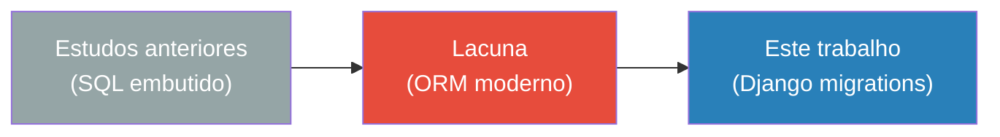
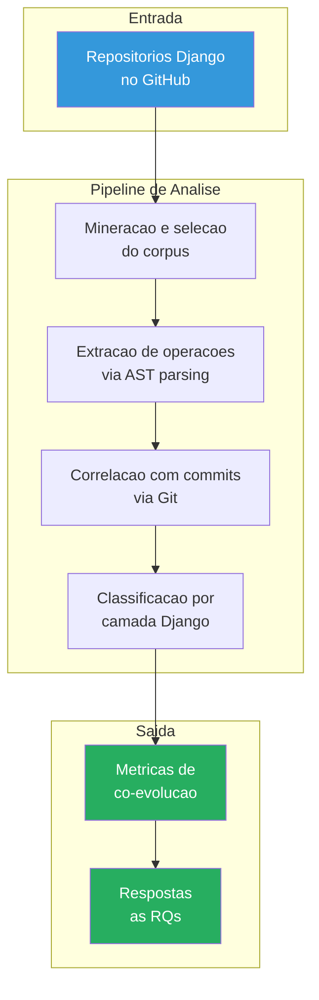

# Tema

## Titulo

Co-evolucao entre Schema e Codigo de Aplicacao em Projetos Django Open-Source: Um Estudo Empirico Baseado em Mineracao de Repositorios

## Contexto

Aplicacoes web modernas dependem de bancos de dados relacionais cujo schema evolui ao longo do ciclo de vida do software. Quando o schema muda — novas tabelas, campos adicionados, colunas removidas — o codigo da aplicacao frequentemente precisa ser adaptado para refletir essas mudancas. Esse fenomeno e chamado de **co-evolucao entre schema e codigo**.

No ecossistema Django, o framework fornece um mecanismo formal para evolucao de schema: o sistema de **migrations**. Migrations sao arquivos Python gerados automaticamente a partir de alteracoes nos modelos (`models.py`) via o comando `makemigrations`. Essa padronizacao torna projetos Django particularmente adequados para estudo empirico de co-evolucao, pois:

1. Mudancas de schema sao rastreaveis como arquivos versionados no Git
2. Operacoes de schema sao estruturadas e parseaveispor AST (Abstract Syntax Tree)
3. O fluxo causal e bem definido: models.py -> migration -> codigo downstream

## Problema

Embora a relacao entre schema e codigo seja reconhecida na literatura, estudos anteriores focaram predominantemente em sistemas com SQL explicitamente embutido no codigo (Qiu et al., 2013) ou em abordagens de deteccao de inconsistencias (Meurice et al., 2016). Pouco se sabe sobre como essa co-evolucao se manifesta em frameworks ORM modernos como Django, onde o schema e gerenciado de forma declarativa e as migrations sao geradas automaticamente.

## Questoes em Aberto

- Quando o schema evolui em projetos Django, o codigo e adaptado no mesmo commit ou de forma desacoplada?
- Quais camadas da arquitetura (views, admin, serializers, tests) sao mais afetadas por mudancas de schema?
- Projetos de naturezas diferentes (aplicacoes vs bibliotecas) exibem padroes de co-evolucao distintos?

## Abordagem

Este trabalho adota uma abordagem de **Mineracao de Repositorios de Software (MSR)**, analisando empiricamente o historico de commits de projetos Django open-source hospedados no GitHub. A analise combina parsing AST dos arquivos de migration com dados do Git para correlacionar mudancas de schema com mudancas no codigo da aplicacao.

## Escopo

- **Inclui:** Projetos Django open-source com historico de migrations suficiente (>= 15 migrations), hospedados no GitHub, ativos nos ultimos 2 anos.
- **Nao inclui:** Projetos com SQL raw fora do ORM, projetos privados, frameworks nao-Django (Flask, FastAPI, etc.), analise de migrations squashed ou customizadas.

## Contribuicoes Esperadas

1. Caracterizacao empirica do grau de acoplamento entre schema e codigo em projetos Django
2. Mapeamento dos padroes de propagacao de mudancas de schema pelas camadas da arquitetura Django
3. Comparacao entre aplicacoes full-stack e bibliotecas reutilizaveis
4. Pipeline reprodutivel de scripts para mineracao e analise de co-evolucao em projetos Django
