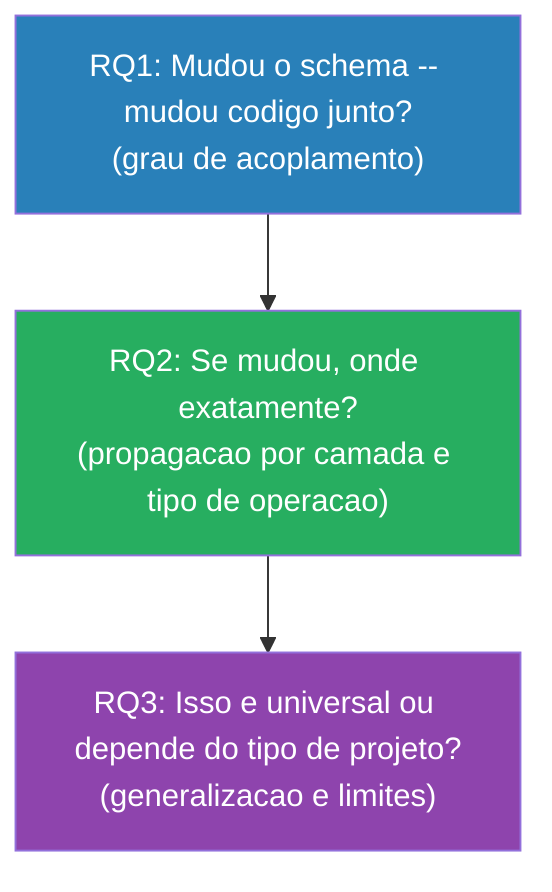

# Perguntas de Pesquisa

## RQ1: Qual o grau de acoplamento entre mudancas de schema e mudancas no codigo de aplicacao nos commits de projetos Django open-source?

**Medir:** Co-evolution ratio — proporcao de commits que introduzem migrations e tambem alteram arquivos de codigo (excluindo as proprias migrations).

**Desdobramentos:**
- Proporcao de commits acoplados (migration + codigo) vs commits migration-only
- Distribuicao do numero de arquivos de codigo co-modificados por commit
- Code churn (LOC adicionadas + removidas) nos commits acoplados vs migration-only

**Dados:** Para cada migration, identificar o commit que a introduziu (`git log --diff-filter=A`) e listar os demais arquivos alterados (`git diff-tree --numstat`).

**Hipotese:** A maioria dos commits com migration tambem altera models.py (pois `makemigrations` parte de mudancas em models), mas uma parcela relevante nao toca camadas downstream (views, admin, tests), indicando acoplamento parcial.

---

## RQ2: Quais camadas da arquitetura Django sao mais frequentemente co-modificadas em resposta a evolucoes de schema, e como essa distribuicao se relaciona com o tipo de operacao de migration realizada?

**Medir:**
- Frequencia de co-modificacao por camada Django (model, view, admin, serializer, form, test, url, template)
- Cruzamento: tipo de operacao (AddField, CreateModel, RemoveField, AlterField, etc.) x camada afetada

**Dados:** Classificacao dos arquivos alterados por papel na arquitetura Django + tipo de operacao extraido via AST parsing das migrations.

**Hipotese:**
- models.py e admin.py sao as camadas mais frequentemente co-modificadas (epicentro da propagacao)
- Operacoes de ciclo de vida de modelo (CreateModel, DeleteModel) afetam mais camadas que operacoes de campo (AddField, AlterField)
- Tests e templates sao camadas menos acopladas a mudancas de schema

---

## RQ3: Os padroes de co-evolucao observados diferem entre aplicacoes Django full-stack e bibliotecas reutilizaveis?

**Medir:** Comparacao das metricas de RQ1 e RQ2 entre dois grupos:
- **Grupo A — Aplicacoes full-stack:** projetos com ciclo completo (models, views, templates, admin)
- **Grupo B — Bibliotecas reutilizaveis:** libs/plugins Django que expoe models mas cujo codigo downstream vive em outros projetos

**Dados:** Mesma pipeline, com segmentacao por grupo definido na fase de selecao do corpus.

**Hipotese:** Bibliotecas apresentam co-evolution ratio menor que aplicacoes full-stack, pois mudancas de schema em libs propagam para codigo de terceiros (fora do repositorio analisado), enquanto aplicacoes concentram toda a propagacao internamente.

---

## Narrativa

As tres perguntas constroem uma investigacao progressiva:

## Definicoes Operacionais

- **Co-evolucao:** arquivos alterados no mesmo commit que introduziu a migration. Definicao simples, reprodutivel e nao-arbitraria. Limitacoes discutidas em [05-decisoes.md](05-decisoes.md).
- **Camada Django:** classificacao baseada no nome/caminho do arquivo (ver tabela em [04-metodologia.md](04-metodologia.md)).
- **Tipo de operacao:** classe da operacao no campo `operations` da migration, extraida via AST (ex: `migrations.AddField`, `migrations.CreateModel`).
- **Aplicacao full-stack vs biblioteca:** classificacao manual do corpus com base na natureza do projeto (presenca de views, templates, admin vs exposicao de models/API para terceiros).
