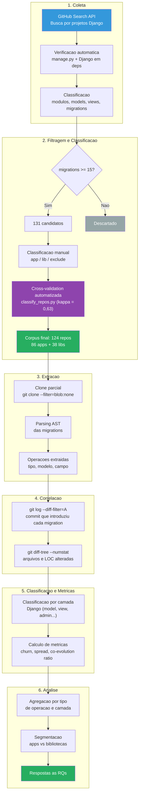
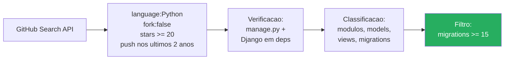
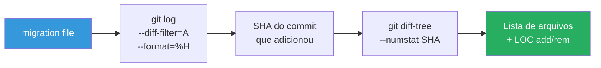
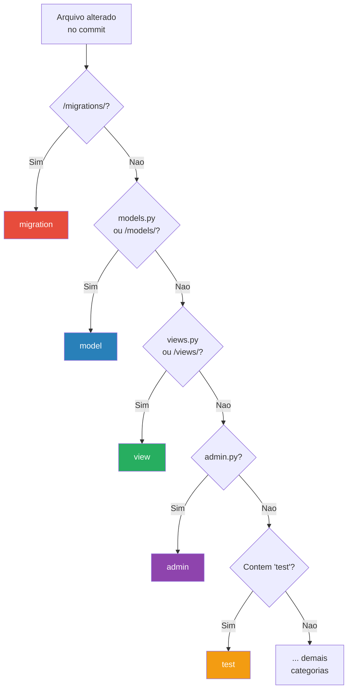

# Metodologia

## Visao Geral

Estudo empirico quantitativo baseado em mineracao de repositorios de software (MSR).

## Pipeline



### Scripts da pipeline

| Etapa | Script | Entrada | Saida |
|-------|--------|---------|-------|
| Coleta + Filtragem | `mine_repositories.py` / `mine_repositories_full.py` | GitHub API | `candidates.csv` |
| Classificacao | `classify_repos.py` | `candidates_full.json` + GitHub API | `corpus_classification_auto.json` |
| Extracao | `extract_migrations.py` | Repos clonados | `migrations.json` |
| Correlacao + Metricas | `analyze_coevolution.py` | Repos clonados | `coevolution.json` |

## Selecao do Corpus

### Criterios de inclusao



1. Projeto Django real (verificado via manage.py + requirements.txt/pyproject.toml)
2. Linguagem principal: Python
3. Nao e fork
4. Push nos ultimos 2 anos
5. >= 20 stars
6. >= 15 arquivos de migration
7. >= 1 app Django com migrations

### Fonte

GitHub Search API, adaptando a infraestrutura do STAR-RG/django-smells.
Referencia: https://github.com/STAR-RG/django-smells

Detalhamento completo do processo de selecao em [06-selecao-corpus.md](06-selecao-corpus.md).

## Extracao de Dados

### Operacoes de migration (AST)

Django migrations seguem uma estrutura canonica:

```python
class Migration(migrations.Migration):
    operations = [
        migrations.AddField(model_name='Order', name='status', ...),
    ]
```

O parser AST extrai: tipo da operacao, modelo afetado, campo (quando aplicavel).


### Categorias de operacoes

| Categoria | Operacoes |
|-----------|-----------|
| Ciclo de vida do modelo | CreateModel, DeleteModel |
| Mudancas de campo | AddField, RemoveField, AlterField, RenameField |
| Indices e constraints | AddIndex, RemoveIndex, AddConstraint, RemoveConstraint |
| Metadados do modelo | AlterModelOptions, AlterModelTable, RenameModel, AlterUniqueTogether, AlterIndexTogether |
| Customizadas | RunSQL, RunPython, SeparateDatabaseAndState |

### Associacao migration -> codigo (Git)

Definicao operacional: **os arquivos alterados no mesmo commit que introduziu a migration**.



### Classificacao de arquivos

Cada arquivo alterado e classificado por seu papel na arquitetura Django:

| Categoria | Criterio |
|-----------|----------|
| migration | Dentro de /migrations/ |
| model | models.py ou /models/ |
| view | views.py ou /views/ |
| serializer | serializers.py ou /serializers/ |
| form | forms.py ou /forms/ |
| admin | admin.py |
| test | Contem 'test' no caminho |
| url | urls.py |
| template | Arquivo .html |
| other_python | Outros .py |
| other | Demais arquivos |



## Metricas

| Metrica | Descricao | RQ |
|---------|-----------|-----|
| **Co-evolution ratio** | Proporcao de migration commits que tambem alteram codigo | RQ1 |
| **Code churn** | LOC adicionadas + removidas (excluindo migrations) | RQ1, RQ2 |
| **Spread** | Numero de arquivos de codigo alterados por commit | RQ1, RQ2 |
| **Category distribution** | Frequencia de cada camada nos commits com migration | RQ2 |
| **Operation type distribution** | Frequencia e impacto de cada tipo de operacao | RQ2 |
| **Group comparison** | Metricas acima segmentadas por apps vs libs | RQ3 |

## Ameacas a Validade

Ver [05-decisoes.md](05-decisoes.md) para discussao detalhada de limitacoes e decisoes metodologicas.
