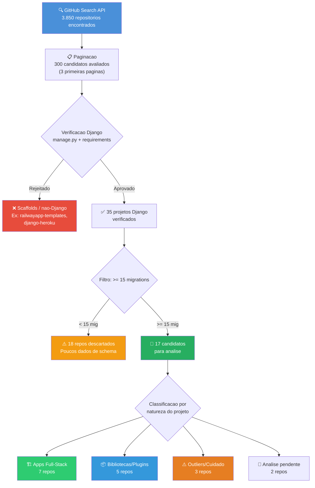
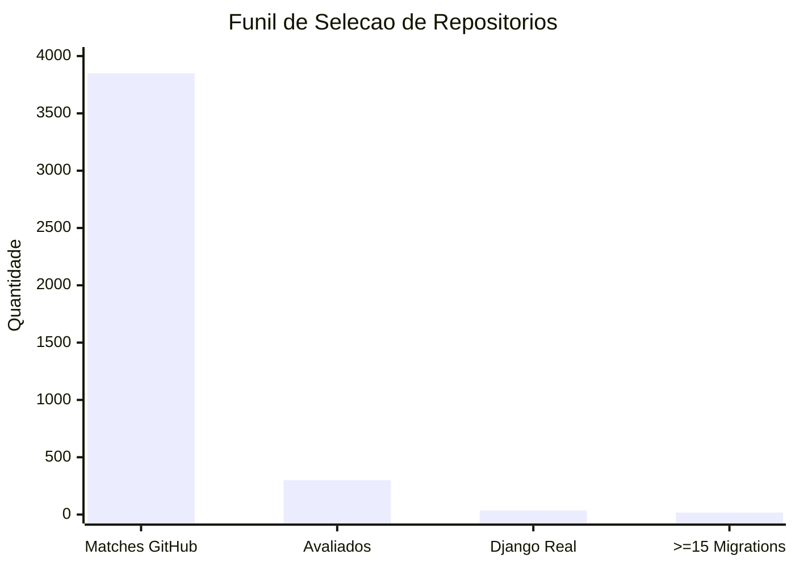
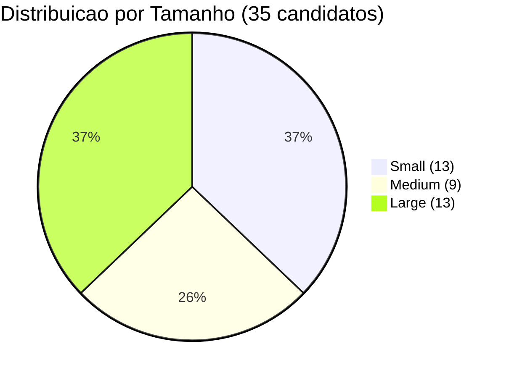
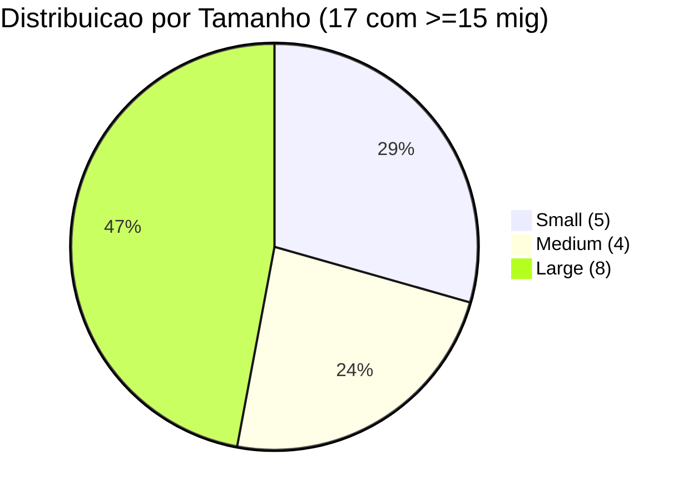
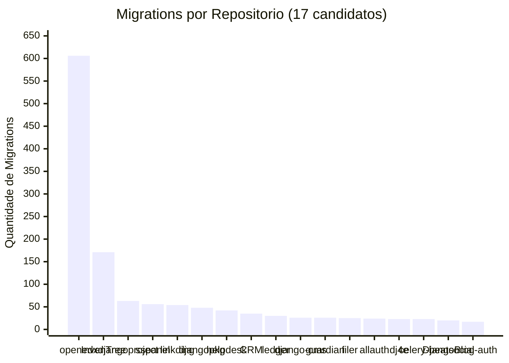
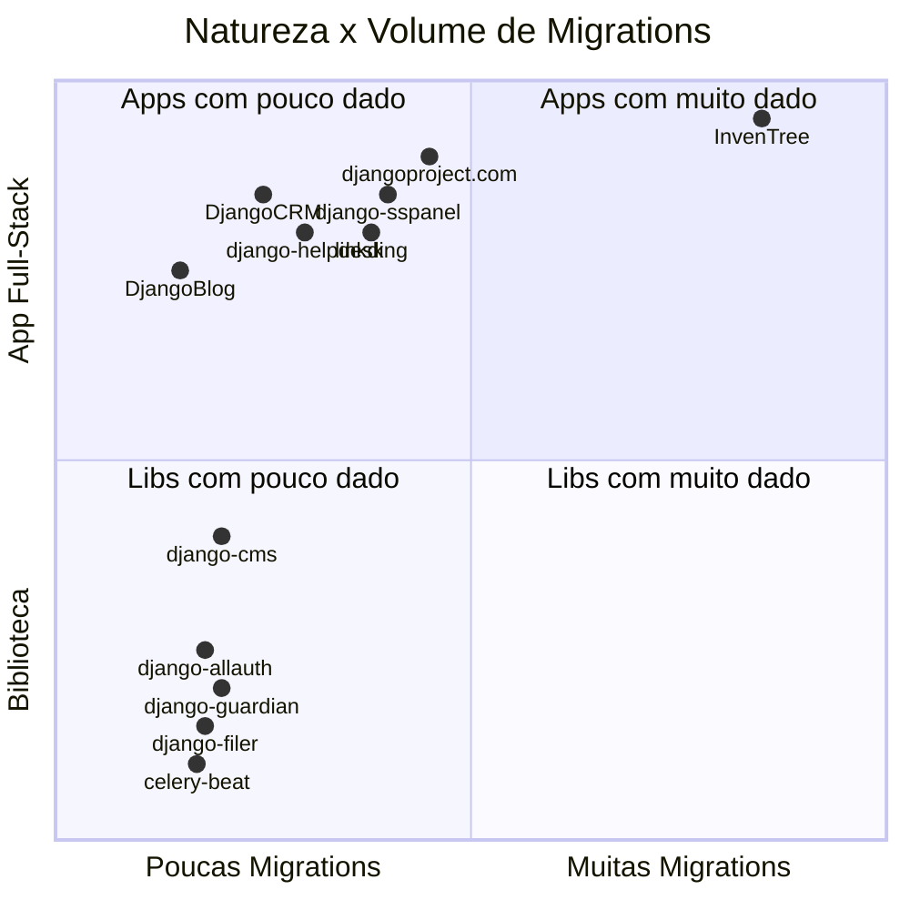
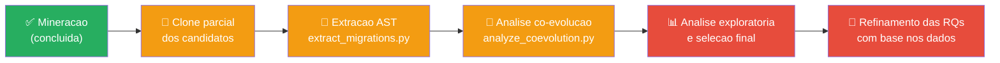

# Selecao do Corpus

Documentacao completa do processo de mineracao, filtragem e selecao dos repositorios que compoem o corpus do estudo.

**Data da mineracao:** 2026-09-29
**Script utilizado:** `scripts/mine_repositories.py`

---

## 1. Visao Geral do Processo

O processo de selecao segue um funil progressivo de filtragem, partindo de uma busca ampla no GitHub ate chegar nos repositorios aptos para analise de co-evolucao.



---

## 2. Parametros da Busca

### Query GitHub Search API

```
django in:name,description,readme,topics language:Python fork:false pushed:>=2024-09-29 stars:>=20
```

### Criterios aplicados em sequencia

| # | Criterio | Tipo | Responsavel |
|---|----------|------|-------------|
| 1 | Termo "django" no nome, descricao, readme ou topics | Busca | GitHub API |
| 2 | Linguagem principal: Python | Busca | GitHub API |
| 3 | Nao e fork | Busca | GitHub API |
| 4 | Push nos ultimos 2 anos (desde 2024-09-29) | Busca | GitHub API |
| 5 | >= 20 stars | Busca | GitHub API |
| 6 | Projeto Django real (manage.py + Django em deps) | Verificacao | `mine_repositories.py` |
| 7 | >= 15 arquivos de migration | Filtragem | `mine_repositories.py` |

### Numeros do funil



| Etapa | Quantidade | % do anterior |
|-------|-----------|---------------|
| Matches na busca GitHub | 3.850 | — |
| Candidatos avaliados (3 paginas) | 300 | 7,8% |
| Verificados como projeto Django real | 35 | 11,7% |
| Com >= 15 migrations | 17 | 48,6% |

> **Nota:** Apenas 3 paginas de resultados foram avaliadas (300 repos). Uma mineracao mais extensa cobriria mais candidatos, mas o custo de API cresce linearmente e o retorno marginal diminui (repos com menos stars tendem a ter menos migrations).

---

## 3. Distribuicao por Tamanho

O script classifica cada repositorio em Small, Medium ou Large com base na contagem de modulos, models e views.





**Observacao:** Repos maiores tem mais chance de ultrapassar o limiar de 15 migrations, mas repos Small com muitas migrations (ex: linkding com 54) indicam schema ativo mesmo em projetos menores.

---

## 4. Catalogo Completo dos 17 Candidatos

### 4.1 Apps Full-Stack (Melhor fit pro estudo)

Projetos que sao aplicacoes Django completas, com models, views, templates — ciclo real de desenvolvimento.

| Repo | Stars | Mig | Apps | Descricao |
|------|-------|-----|------|-----------|
| **inventree/InvenTree** | 7.655 | 171 | 13 | ERP/inventario open-source. Dominio complexo, muitas entidades. |
| **django/djangoproject.com** | 2.019 | 63 | 11 | Site oficial do Django. Referencia de boas praticas. |
| **Ehco1996/django-sspanel** | 3.073 | 56 | 4 | Painel de proxy/VPN. Medio porte, boa variedade de ops. |
| **sissbruecker/linkding** | 11.260 | 54 | 1 | Gerenciador de bookmarks. 1 app com schema ativo. |
| **django-helpdesk/django-helpdesk** | 1.686 | 42 | 1 | Sistema de tickets. Schema concentrado em 1 app. |
| **DjangoCRM/django-crm** | 631 | 35 | 10 | CRM completo. 10 apps, boa distribuicao. |
| **liangliangyy/DjangoBlog** | 7.435 | 20 | 5 | Blog Django. Menor mas projeto real. |

**Por que sao ideais:** Representam evolucao organica de schema em apps reais. Commits refletem features, bugfixes, refactors — nao releases de biblioteca.

### 4.2 Bibliotecas e Plugins Django

Projetos que sao libs reutilizaveis. Tem migrations, mas padrao de co-evolucao diferente.

| Repo | Stars | Mig | Apps | Descricao |
|------|-------|-----|------|-----------|
| **pennersr/django-allauth** | 10.376 | 24 | 7 | Autenticacao/OAuth. Lib madura, muito usada. |
| **django-cms/django-cms** | 10.673 | 26 | 2 | CMS plugavel. Hibrido lib/app. |
| **django-guardian/django-guardian** | 3.917 | 26 | 5 | Permissoes por objeto. Lib focada. |
| **django-cms/django-filer** | 1.853 | 25 | 4 | Gerenciador de arquivos. Plugin do django-cms. |
| **celery/django-celery-beat** | 1.951 | 23 | 2 | Scheduler de tarefas. Lib de infra. |

**Nota:** Libs tendem a ter migrations mais "isoladas" — schema muda mas codigo downstream (views, templates) nao existe dentro do repo. Co-evolucao medida pode ser subestimada. Podem servir como **grupo de contraste** se quisermos comparar apps vs libs.

### 4.3 Outliers e Casos Especiais

| Repo | Stars | Mig | Problema |
|------|-------|-----|----------|
| **openedx/openedx-platform** | 8.197 | 606 | Gigante (80 modulos, 83 apps com mig). Pode dominar totalmente as metricas agregadas. |
| **csev/dj4e-samples** | 605 | 23 | Projeto **didatico** (Django for Everybody). Migrations nao representam evolucao real — sao exemplos de aula. |
| **arrobalytics/django-ledger** | 1.389 | 30 | 0 models e 0 views detectados. Estrutura nao convencional — pode precisar investigacao manual. |

### 4.4 Demais Candidatos (< 15 migrations)

| Repo | Stars | Mig | Motivo da exclusao |
|------|-------|-----|--------------------|
| djangopackages/djangopackages | 956 | 48 | ✅ Acima do limiar — **incluido acima como Large** |
| python-social-auth/social-app-django | 2.145 | 17 | ✅ Acima do limiar — incluido como lib |
| xhongc/music-tag-web | 6.082 | 11 | Abaixo do limiar (11 mig) |
| django-wiki/django-wiki | 1.937 | 10 | Abaixo do limiar (10 mig) |
| django-commons/django-polymorphic | 1.835 | 12 | Abaixo do limiar (12 mig) |
| dj-bolt/django-bolt | 1.702 | 7 | Abaixo do limiar |
| sshwsfc/xadmin | 4.746 | 6 | Abaixo do limiar |
| jieter/django-tables2 | 2.008 | 5 | Abaixo do limiar |
| dennisivy/crash-course-CRM | 584 | 5 | Abaixo do limiar + projeto didatico |
| geex-arts/django-jet | 3.621 | 3 | Abaixo do limiar |
| typeddjango/django-stubs | 1.975 | 2 | Stubs de tipo, nao app real |
| creativetimofficial/soft-ui-dashboard-django | 111 | 2 | Template/dashboard, poucas mig |
| wsvincent/lithium | 2.460 | 1 | Apenas 1 migration |
| Demais (0 migrations) | — | 0 | django-extensions, Archery, DefectDojo, django-mptt, django-bootstrap3, vintasoftware, render-examples |

> **Nota:** Repos com 0 migrations detectadas podem ter migrations em locais nao-convencionais, ou usarem outro mecanismo de schema. Nao foram investigados individualmente.

---

## 5. Distribuicao de Migrations nos 17 Candidatos



**Observacoes:**
- openedx-platform e um outlier extremo (606 mig vs media de ~50 nos demais)
- Excluindo openedx, faixa vai de 17 a 171 migrations — distribuicao mais uniforme
- InvenTree tambem se destaca mas em proporcao razoavel

---

## 6. Mapa de Cobertura: Natureza x Tamanho



> openedx (606 mig) e dj4e-samples (didatico) omitidos do quadrante por serem outliers.

---

## 7. Decisoes Pendentes

| Decisao | Opcoes | Status |
|---------|--------|--------|
| Incluir openedx-platform? | (a) Incluir e tratar como outlier, (b) Excluir, (c) Analisar separadamente | ⏳ Pendente |
| Excluir dj4e-samples? | Projeto didatico — migrations nao representam evolucao real | ⏳ Provavel exclusao |
| Investigar django-ledger? | 0 models/views detectados — estrutura pode ser nao-convencional | ⏳ Pendente |
| Separar apps vs libs? | Analisar juntos vs criar grupos de comparacao | ⏳ Pendente |
| Expandir mineracao? | Cobrir mais paginas do GitHub (alem das 3 iniciais) | ⏳ Avaliar apos analise exploratoria |

---

## 8. Proximos Passos



---

## Apendice: Dados Brutos

- CSV completo: [`data/raw/candidates.csv`](../data/raw/candidates.csv)
- JSON completo: [`data/raw/candidates.json`](../data/raw/candidates.json)
- Script de mineracao: [`scripts/mine_repositories.py`](../scripts/mine_repositories.py)
