# Selecao do Corpus

Documentacao completa do processo de mineracao, filtragem, classificacao e selecao final dos repositorios que compoem o corpus do estudo.

---

## 1. Visao Geral do Processo

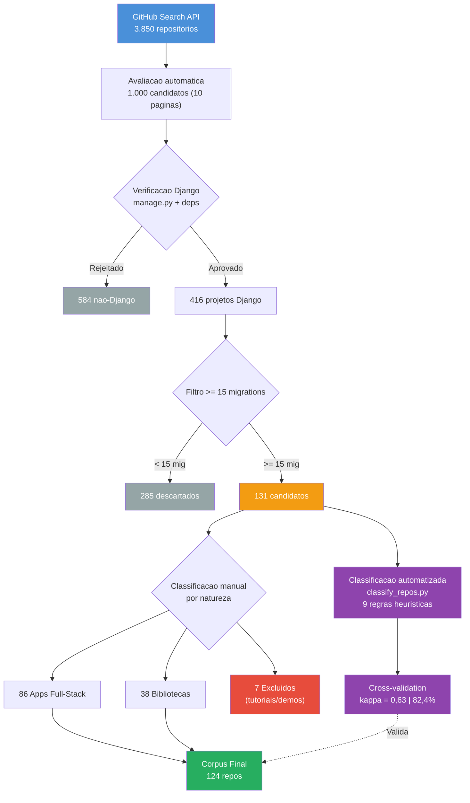

---

## 2. Evolucao da Mineracao: v1 vs v2

O processo de mineracao passou por duas iteracoes. A primeira revelou uma limitacao no script que motivou a criacao da segunda versao.

### 2.1 Primeira rodada (v1) — 2026-09-29

**Script:** `mine_repositories.py`
**Estrategia:** Bucket-filling — parava ao preencher quotas de Small/Medium/Large.

| Etapa | Quantidade |
|-------|-----------|
| Matches GitHub | 3.850 |
| Avaliados | ~300 (3 paginas) |
| Verificados como Django | 35 |
| Com >= 15 migrations | 17 |

**Problema identificado:** O script parava na pagina 3 ao preencher os buckets (~11 por tamanho). Repos com muitas migrations nas paginas 4-10 eram ignorados. A logica de bucket priorizava balanceamento de tamanho sobre volume de migrations.

### 2.2 Segunda rodada (v2) — 2026-09-30

**Script:** `mine_repositories_full.py`
**Estrategia:** Full-scan sem parada antecipada. Todas as 10 paginas. Migration count como criterio principal.

| Etapa | Quantidade |
|-------|-----------|
| Matches GitHub | 3.850 |
| Avaliados | 1.000 (10 paginas) |
| Verificados como Django | 416 |
| Com >= 15 migrations | 131 |

**Mudancas tecnicas:**
- Removida logica de bucket-filling
- Adicionado retry com exponential backoff para erros de conexao (ate 5 tentativas)
- Output ordenado por migration_count (decrescente)
- Todos os repos verificados salvos (nao apenas os acima do limiar)

### 2.3 Comparacao direta

```mermaid
xychart-beta
    title "Comparacao v1 vs v2"
    x-axis ["Avaliados", "Verificados", ">=15 Migrations"]
    y-axis "Quantidade" 0 --> 1100
    bar [300, 35, 17]
    bar [1000, 416, 131]
```

| Metrica | v1 | v2 | Ganho |
|---------|----|----|-------|
| Repos avaliados | 300 | 1.000 | 3.3x |
| Verificados como Django | 35 | 416 | 11.9x |
| Com >= 15 migrations | 17 | 131 | 7.7x |
| Paginas escaneadas | 3 | 10 | 3.3x |
| Tempo de execucao | ~5 min | ~25 min | — |

> **Conclusao:** A v1 capturou apenas 13% dos repos elegíveis. A limitacao de bucket-filling causava perda sistematica de dados. A v2 corrigiu isso com ganho de 7.7x no corpus.

---

## 3. Numeros do Funil (v2)

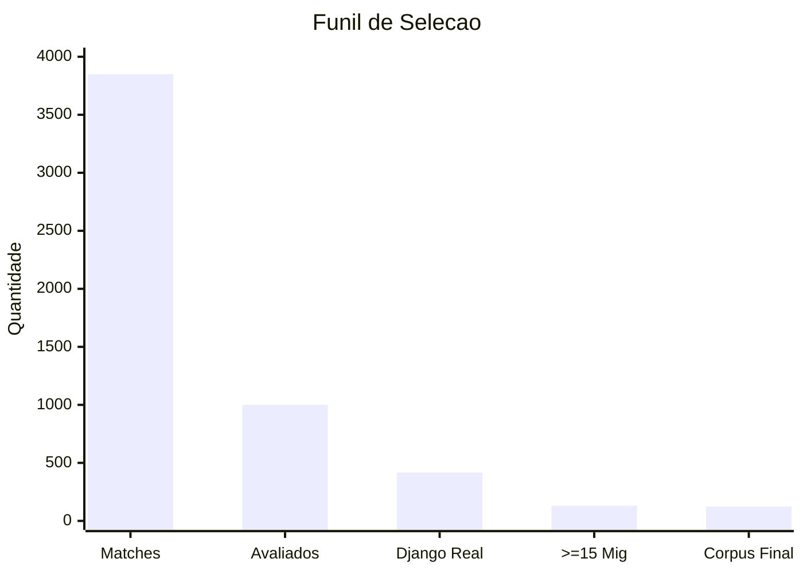

| Etapa | Quantidade | % do anterior | Metodo |
|-------|-----------|---------------|--------|
| Matches na busca GitHub | 3.850 | -- | GitHub Search API |
| Candidatos avaliados | 1.000 | 26,0% | 10 paginas x 100 |
| Verificados como Django real | 416 | 41,6% | manage.py + deps |
| Com >= 15 migrations | 131 | 31,5% | Contagem via tree API |
| Corpus final (excl. tutoriais) | 124 | 94,7% | Classificacao manual |

---

## 4. Distribuicoes

### 4.1 Por Tamanho do Projeto

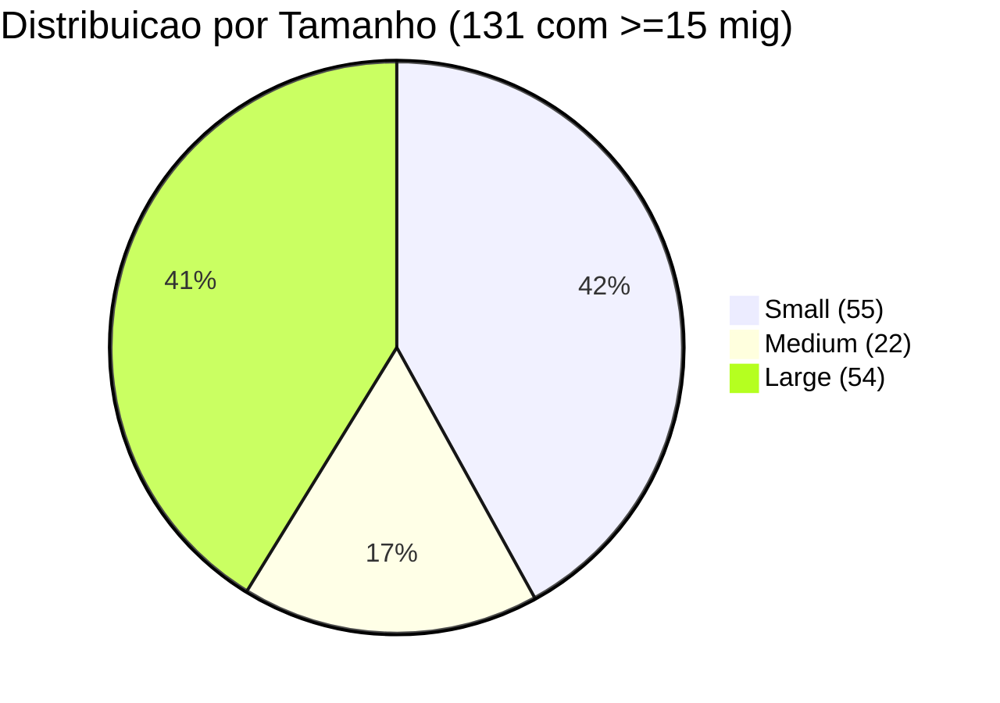

### 4.2 Por Faixa de Migrations

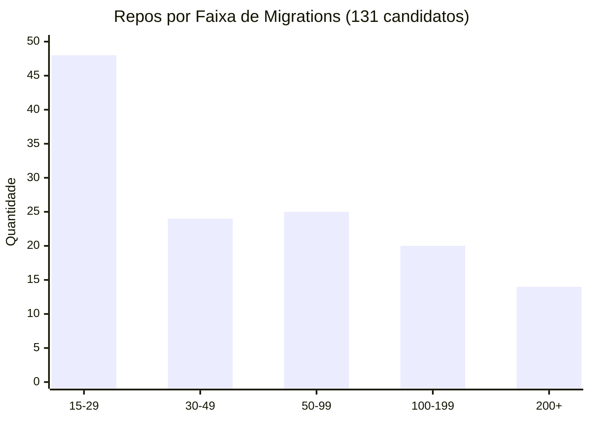

| Faixa | Quantidade | % |
|-------|-----------|---|
| 15-29 | 48 | 36,6% |
| 30-49 | 24 | 18,3% |
| 50-99 | 25 | 19,1% |
| 100-199 | 20 | 15,3% |
| 200+ | 14 | 10,7% |

### 4.3 Por Natureza (Apps vs Libs)

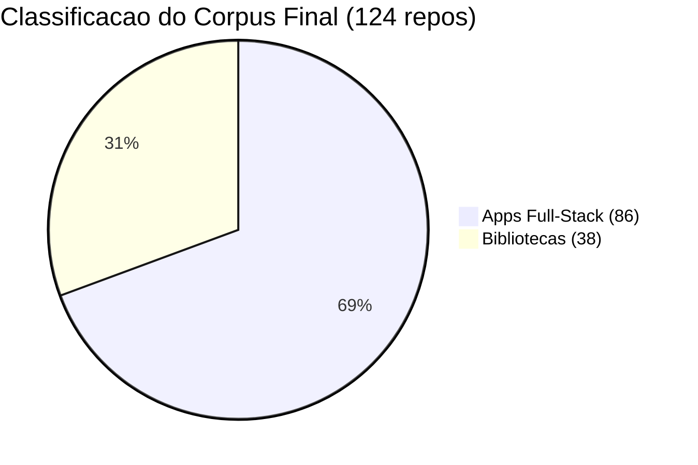

| Grupo | Repos | Migrations total | Media por repo | Min | Max |
|-------|-------|-----------------|----------------|-----|-----|
| Apps | 86 | 10.724 | 125 | 15 | 666 |
| Libs | 38 | 1.131 | 30 | 15 | 131 |
| **Total** | **124** | **11.855** | **96** | **15** | **666** |

> Apps concentram 90% das migrations do corpus. Libs tem schema mais enxuto — consistente com a hipotese de que co-evolucao em libs e menor (RQ3).

---

## 5. Classificacao por Natureza

### 5.1 Criterios de Classificacao

A classificacao foi feita manualmente para cada um dos 131 repos e validada por um classificador heuristico automatizado (secao 5.5). Os criterios manuais consideraram:

1. **Nome e descricao do repositorio** no GitHub
2. **Proposito do projeto:** aplicacao completa vs componente reutilizavel
3. **Presenca de views, templates, admin:** apps tem ciclo completo; libs expoe models/API
4. **Padrao de uso:** libs sao instaladas via pip em outros projetos; apps rodam standalone

| Classificacao | Definicao | Exemplos |
|---------------|-----------|----------|
| **App** | Aplicacao Django completa, com ciclo de desenvolvimento real (features, bugfixes, deploy) | healthchecks, InvenTree, djangoproject.com |
| **Lib** | Pacote Django reutilizavel, instalado em outros projetos. Schema proprio mas codigo downstream vive fora do repo | django-allauth, django-celery-beat, django-guardian |
| **Excluido** | Projeto didatico, demo ou tutorial — migrations nao representam evolucao real de schema | dj4e-samples, bakerydemo, locallibrary-tutorial |

### 5.2 Apps Full-Stack (86 repos)

| Repo | Mig | Stars | Dominio |
|------|-----|-------|---------|
| mozilla/addons-server | 666 | 903 | Marketplace de extensoes |
| openedx/openedx-platform | 606 | 8.199 | LMS educacional |
| aropan/clist | 604 | 440 | Agregador de competicoes |
| MozillaFoundation/foundation.mozilla.org | 571 | 394 | Site institucional |
| MuckRock/muckrock | 548 | 125 | Plataforma FOIA |
| wevote/WeVoteServer | 425 | 56 | Plataforma de votacao |
| kobotoolbox/kpi | 383 | 185 | Coleta de dados humanitaria |
| SEED-platform/seed | 355 | 121 | Gestao energetica de edificios |
| bookwyrm-social/bookwyrm | 319 | 2.790 | Rede social de leitura |
| okfde/froide | 275 | 410 | Plataforma FOI |
| okfde/fragdenstaat_de | 241 | 148 | Plataforma FOI (Alemanha) |
| python/pythondotorg | 222 | 1.666 | Site python.org |
| freelawproject/courtlistener | 219 | 1.035 | Pesquisa juridica |
| Cloud-CV/EvalAI | 200 | 2.044 | Avaliacao de modelos AI |
| numerique-gouv/sites-conformes | 199 | 68 | Conformidade de sites gov |
| healthchecks/healthchecks | 187 | 10.371 | Monitoramento de cron jobs |
| inventree/InvenTree | 171 | 7.661 | ERP/inventario |
| apluslms/a-plus | 170 | 74 | Sistema de gestao de aprendizado |
| onaio/onadata | 163 | 188 | Coleta e analise de dados |
| vas3k/vas3k.club | 152 | 939 | Plataforma comunitaria |
| codalab/codabench | 151 | 178 | Benchmarking de ML |
| ietf-tools/datatracker | 149 | 1.094 | Rastreamento de documentos IETF |
| okfn/website | 145 | 109 | Site OKFN |
| digitalfox/pydici | 145 | 148 | CRM para consultorias |
| TareqMonwer/Django-School-Management | 144 | 593 | Gestao escolar |
| mozilla/kitsune | 144 | 1.657 | Suporte Mozilla (SUMO) |
| horilla/horilla-crm | 138 | 92 | Gestao de RH |
| modoboa/modoboa | 132 | 3.541 | Plataforma de email |
| python-discord/site | 121 | 650 | Site Python Discord |
| learningequality/studio | 120 | — | Autoria de conteudo Kolibri |
| open5e/open5e-api | 116 | — | API D&D 5e |
| mataroablog/mataroa | 114 | — | Plataforma de blog |
| bustimes/bustimes.org | 106 | — | Horarios de onibus UK |
| brightbeanxyz/brightbean-studio | 97 | — | Plataforma criativa |
| OSMCha/osmcha-django | 97 | — | Analisador OpenStreetMap |
| Nitrate/Nitrate | 79 | — | Gestao de casos de teste |
| KoalixSwitzerland/koalixcrm | 78 | — | CRM/ERP |
| kiwitcms/Kiwi | 67 | — | Gestao de testes |
| ialbert/biostar-central | 65 | — | Q&A bioinformatica |
| apache/airavata-django-portal | 64 | — | Portal cientifico |
| samuelclay/NewsBlur | 64 | — | Leitor RSS |
| django/djangoproject.com | 63 | 2.019 | Site oficial Django |
| mpkasp/django-bom | 63 | — | Gestao de BOM |
| kobotoolbox/kobocat | 60 | — | Backend KoBoToolbox |
| DataTalksClub/course-management-platform | 60 | — | Gestao de cursos |
| dfirtrack/dfirtrack | 58 | — | Forense digital |
| Ehco1996/django-sspanel | 56 | 3.073 | Painel proxy/VPN |
| CTPUG/wafer | 56 | — | Gestao de conferencias |
| line/promgen | 55 | — | Gestao Prometheus |
| hassancs91/PyRunner | 55 | — | Executor de codigo online |
| sissbruecker/linkding | 54 | 11.260 | Gerenciador de bookmarks |
| Checkora/Checkora | 53 | — | Plataforma de checklists |
| QingdaoU/OnlineJudge | 52 | — | Juiz online |
| kreneskyp/ix | 50 | — | Plataforma de agentes AI |
| getpatchwork/patchwork | 49 | — | Rastreamento de patches |
| DjangoGirls/djangogirls | 49 | — | Gestao de eventos DjangoGirls |
| djangopackages/djangopackages | 48 | 956 | Diretorio de pacotes Django |
| Hopetree/izone | 45 | — | Blog/site pessoal |
| meeb/tubesync | 45 | — | Sync YouTube-media |
| 1Panel-dev/MaxKB | 43 | — | Plataforma AI enterprise |
| nextcloud/appstore | 43 | — | App store Nextcloud |
| silverapp/silver | 42 | — | SaaS billing |
| django-helpdesk/django-helpdesk | 42 | 1.686 | Sistema de tickets |
| lihuacai168/AnotherFasterRunner | 41 | — | Testes de API |
| mwinamijr/django-scms | 38 | — | Gestao escolar |
| cfpb/consumerfinance.gov | 36 | — | Site CFPB (gov EUA) |
| DjangoCRM/django-crm | 35 | 631 | CRM |
| anyant/rssant | 35 | — | Leitor RSS |
| jimmy201602/webterminal | 34 | — | Terminal SSH web |
| innogames/ltc | 32 | — | Dashboard de load tests |
| thomas545/ecommerce_api | 31 | — | API e-commerce |
| phpmyadmin/website | 29 | — | Site phpMyAdmin |
| dtpstat/dtp-stat-archive | 25 | — | Mapa de acidentes |
| Kuldeeep18/LeadOrbit | 24 | — | Gestao de leads |
| liangliangyy/DjangoBlog | 20 | 7.435 | Blog |
| milesmcc/shynet | 20 | — | Analytics web |
| manjurulhoque/django-social-network | 18 | — | Rede social |
| redianmarku/Django-Twitter-Clone | 18 | — | Clone Twitter |
| delitamakanda/elearning | 18 | — | E-learning |
| chenjigang4167/testhub_platform | 18 | — | Plataforma de testes |
| visionsss/recommend_system_version2 | 18 | — | Sistema de recomendacao |
| grahamgilbert/Crypt-Server | 18 | — | Escrow FileVault |
| SkyCascade/SkyLearn | 16 | — | Plataforma educacional |
| AndyGrant/OpenBench | 16 | — | Testes de engines de xadrez |
| apyb/associados | 16 | — | Gestao de associados APyB |
| thiagopena/djangoSIGE | 15 | — | ERP |

### 5.3 Bibliotecas e Plugins (38 repos)

| Repo | Mig | Stars | Funcionalidade |
|------|-----|-------|----------------|
| tbicr/django-pg-zero-downtime-migrations | 131 | 574 | Migrations zero-downtime |
| ansible/django-ansible-base | 83 | — | Base compartilhada Ansible |
| ellmetha/django-machina | 52 | — | Engine de forum |
| adamcharnock/django-hordak | 54 | — | Contabilidade double-entry |
| 3YOURMIND/django-migration-linter | 45 | — | Linter de migrations |
| PragmaticMates/django-invoicing | 35 | — | Faturamento |
| citusdata/django-multitenant | 33 | — | Suporte multi-tenant |
| fabiocaccamo/django-admin-interface | 32 | — | Tema de admin |
| tj-django/django-clone | 32 | — | Clonagem de models |
| arrobalytics/django-ledger | 30 | 1.389 | Contabilidade |
| django-getpaid/django-getpaid | 29 | — | Framework de pagamentos |
| palewire/django-calaccess-raw-data | 29 | — | Dados eleitorais California |
| explorerhq/sql-explorer | 28 | — | Explorador SQL |
| django-cms/django-cms | 26 | 10.673 | Framework CMS |
| django-guardian/django-guardian | 26 | 3.917 | Permissoes por objeto |
| django-cms/django-filer | 25 | 1.853 | Gestao de arquivos |
| microsoft/mssql-django | 25 | — | Backend MSSQL |
| AmbitionEng/django-pghistory | 25 | — | Historico Postgres |
| pennersr/django-allauth | 24 | 10.376 | Autenticacao/OAuth |
| SectorLabs/django-postgres-extra | 24 | — | Extensoes Postgres |
| stellar/django-polaris | 24 | — | Anchor server Stellar |
| celery/django-celery-beat | 23 | 1.951 | Scheduler Celery |
| soynatan/django-easy-audit | 23 | — | Auditoria |
| bennylope/django-organizations | 22 | — | Multi-organizacao |
| djaodjin/djaodjin-saas | 22 | — | Gestao SaaS |
| RealOrangeOne/django-tasks-db | 21 | — | Backend de tarefas |
| viewflow/viewflow | 20 | — | Workflow/BPM |
| Yuego/django-fias | 20 | — | Enderecos russos |
| spookylukey/django-paypal | 19 | — | Integracao PayPal |
| socotecio/django-socio-grpc | 18 | — | Integracao gRPC |
| PaulGilmartin/django-pgpubsub | 18 | — | Pub/sub Postgres |
| python-social-auth/social-app-django | 17 | 2.145 | Auth social |
| simplecto/django-reference-implementation | 17 | — | Implementacao referencia |
| reactive-python/reactpy-django | 16 | — | Integracao ReactPy |
| django-otp/django-otp | 16 | — | OTP/2FA |
| matijakolaric-com/django-music-publisher | 16 | — | Publicacao musical |
| yunojuno/elasticsearch-django | 16 | — | Integracao Elasticsearch |
| AmbitionEng/django-pgtrigger | 15 | — | Triggers Postgres |

### 5.4 Excluidos (7 repos)

| Repo | Mig | Motivo |
|------|-----|--------|
| wagtail/bakerydemo | 60 | Demo do Wagtail CMS |
| wsvincent/rest-framework-tutorial | 45 | Tutorial DRF |
| mdn/django-locallibrary-tutorial | 27 | Tutorial MDN |
| csev/dj4e-samples | 23 | Exemplos do curso Django for Everybody |
| saksham1991999/django-for-everybody-specialization | 18 | Exercicios de curso |
| HackSoftware/Django-Styleguide-Example | 15 | Exemplo de styleguide |
| codingforentrepreneurs/SaaS-for-Enterprise-with-Django | 28 | Tutorial |

> Projetos didaticos foram excluidos porque suas migrations nao representam evolucao organica de schema — sao exemplos criados para fins de ensino.

### 5.5 Validacao Automatizada (Cross-Validation)

Para reforcar a reprodutibilidade da classificacao, implementamos um classificador heuristico automatizado (`classify_repos.py`) que atribui a mesma label (app/lib/exclude) com base em sinais estruturais do repositorio. O objetivo nao e substituir a classificacao manual, mas validar sua consistencia via cross-validation.

**Script:** [`scripts/classify_repos.py`](../scripts/classify_repos.py)
**Saida:** [`data/processed/corpus_classification_auto.json`](../data/processed/corpus_classification_auto.json), [`data/processed/classification_report.json`](../data/processed/classification_report.json)

#### 5.5.1 Sinais Estruturais Detectados

Para cada repositorio, o classificador coleta sinais via GitHub Tree API e Contents API:

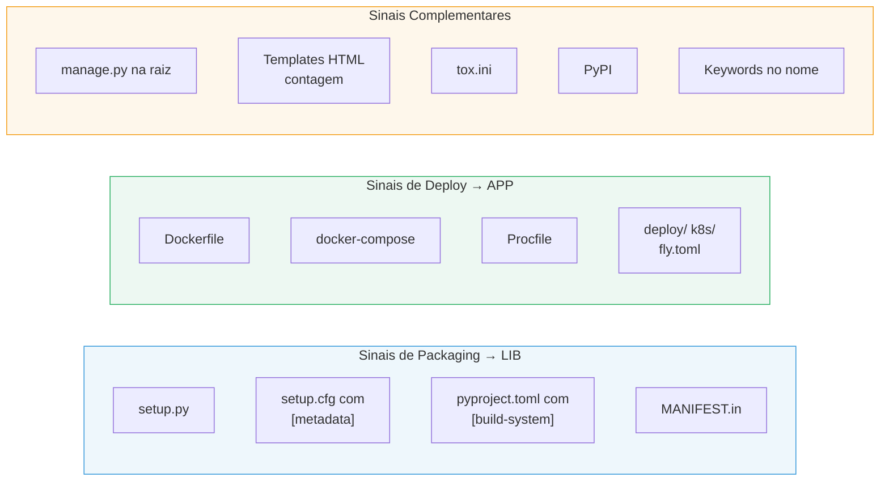

| Categoria | Sinais detectados | Indicativo de |
|-----------|-------------------|---------------|
| Packaging | `setup.py`, `setup.cfg` com `[metadata]`, `pyproject.toml` com `[build-system]`, `MANIFEST.in` | Lib |
| Deploy | `Dockerfile`, `docker-compose`, `Procfile`, diretorios `deploy/`, `k8s/`, configs `fly.toml` | App |
| Templates | Contagem de `.html` em diretorios `templates/` (convencao Django) | App (se >10) |
| Testing | `tox.ini` (teste multi-versao, comum em libs) | Lib |
| PyPI | Pacote publicado no pypi.org (opcional, `--check-pypi`) | Lib |
| Nome | Keywords: tutorial, demo, sample, course, exercise, styleguide, etc. | Exclude |

#### 5.5.2 Arvore de Decisao

As 9 regras sao aplicadas em ordem de prioridade — a primeira que casa determina a classificacao:

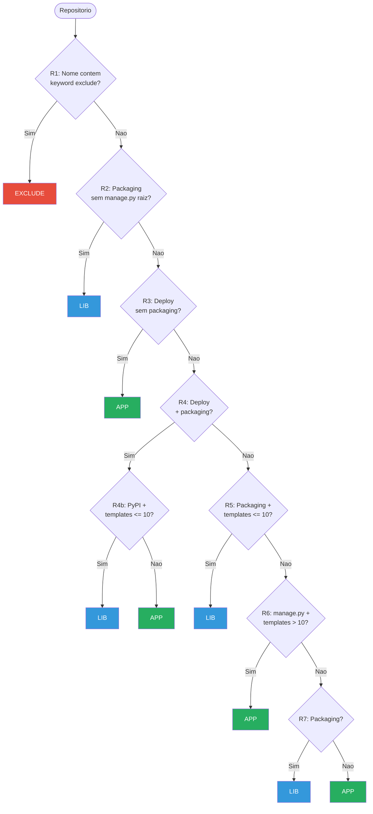

| Regra | Condicao | Resultado | Repos |
|:-----:|----------|:---------:|:-----:|
| R1 | Nome contem keyword de exclusao | Exclude | 6 |
| R2 | Packaging config, sem manage.py na raiz | Lib | 14 |
| R3 | Artefatos de deploy, sem packaging | App | 50 |
| R4a | Deploy + packaging (sem PyPI ou muitos templates) | App | 17 |
| R4b | Deploy + packaging + PyPI + poucos templates | Lib | 12 |
| R5 | Packaging, sem deploy, templates <= 10 | Lib | 10 |
| R6 | manage.py na raiz + templates > 10 | App | 16 |
| R8 | manage.py na raiz (fallback) | App | 5 |
| R9 | Default | App | 1 |

> R3 (deploy sem packaging) e a regra mais frequente — 50 dos 131 repos sao apps com artefatos de deploy claros e sem configuracao de packaging. Este e o caso mais direto de classificacao.

#### 5.5.3 Resultados da Cross-Validation

| Metrica | Valor | Interpretacao |
|---------|:-----:|---------------|
| Concordancia | 108 / 131 | 82,4% dos repos classificados igualmente |
| Desacordos | 23 / 131 | 17,6% de divergencias |
| Cohen's kappa | 0,6279 | Concordancia substancial |

**Escala de interpretacao do kappa** (Landis & Koch, 1977):

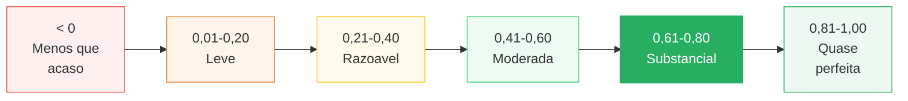

#### 5.5.4 Matriz de Confusao

Linhas = classificacao manual (referencia). Colunas = classificacao automatizada.

|  | **Auto: App** | **Auto: Lib** | **Auto: Exclude** | **Total** |
|:--|:---:|:---:|:---:|:---:|
| **Manual: App** | **76** | 9 | 1 | 86 |
| **Manual: Lib** | 11 | **27** | 0 | 38 |
| **Manual: Exclude** | 2 | 0 | **5** | 7 |
| **Total** | 89 | 36 | 6 | 131 |

#### 5.5.5 Metricas por Classe

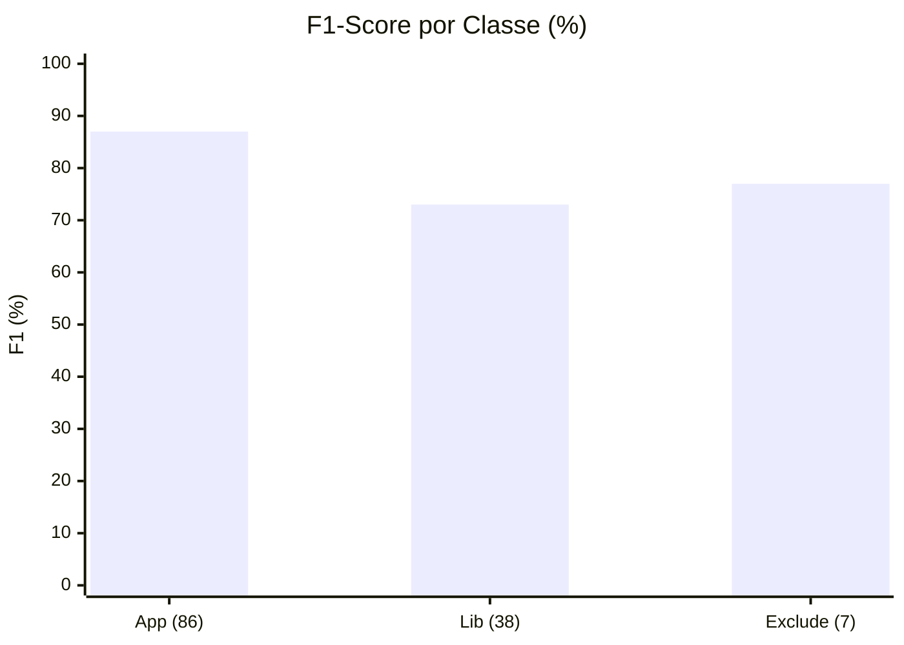

| Classe | Precision | Recall | F1-Score | Suporte |
|:------:|:---------:|:------:|:--------:|:-------:|
| App | 85,4% | 88,4% | 86,9% | 86 |
| Lib | 75,0% | 71,1% | 73,0% | 38 |
| Exclude | 83,3% | 71,4% | 76,9% | 7 |

#### 5.5.6 Analise dos Desacordos

Os 23 desacordos concentram-se em dois padroes estruturais:

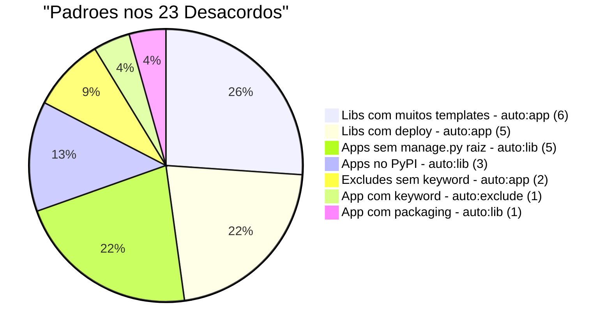

**Padrao 1 — Libs classificadas como App (11 desacordos):**

Bibliotecas que fornecem templates como parte do pacote. A regra R6 (manage.py + templates > 10) classifica incorretamente porque o template count alto e tipico de apps, mas tambem ocorre em libs ricas em UI:

| Repositorio | Templates | Regra | Funcao real |
|-------------|:---------:|:-----:|-------------|
| django-cms/django-cms | 189 | R6 | Framework CMS — templates sao o produto |
| pennersr/django-allauth | 139 | R6 | Auth — templates de login/signup/social |
| viewflow/viewflow | 82 | R6 | Workflow — templates de admin |
| djaodjin/djaodjin-saas | 65 | R6 | SaaS — templates de billing/subscription |
| django-guardian/django-guardian | 39 | R6 | Permissoes — templates de admin |
| bennylope/django-organizations | 21 | R6 | Multi-org — templates de gestao |

Outros 5 desacordos via R4a/R3: libs com `docker-compose` para ambiente de desenvolvimento (`django-getpaid`, `sql-explorer`, `django-polaris`, `django-hordak`, `django-ledger`).

**Padrao 2 — Apps classificadas como Lib (9 desacordos):**

Aplicacoes distribuidas como pacotes pip (sem manage.py na raiz) ou no PyPI:

| Repositorio | Regra | Sinal confundido |
|-------------|:-----:|------------------|
| modoboa/modoboa | R2 | App de email, mas manage.py nao esta na raiz |
| milesmcc/shynet | R2 | Analytics web, estruturado como pacote |
| line/promgen | R2 | Gestao Prometheus, sem manage.py raiz |
| 1Panel-dev/MaxKB | R2 | Plataforma AI, layout nao-convencional |
| Nitrate/Nitrate | R2 | Gestao de testes, sem manage.py raiz |
| mozilla/kitsune | R4b | Suporte Mozilla, tambem publicado no PyPI |
| silverapp/silver | R4b | SaaS billing, tambem no PyPI |
| KoalixSwitzerland/koalixcrm | R4b | CRM/ERP, tambem no PyPI |
| innogames/ltc | R5 | Dashboard, estruturado com packaging |

**Padrao 3 — Excludes (3 desacordos):**

| Repositorio | Manual | Auto | Motivo |
|-------------|:------:|:----:|--------|
| wagtail/bakerydemo | exclude | app (R3) | "demo" embutido em palavra composta |
| codingforentrepreneurs/SaaS-for-Enterprise-with-Django | exclude | app (R3) | Sem keyword de exclusao no nome |
| DataTalksClub/course-management-platform | app | exclude (R1) | "course" no nome, mas e app real |

#### 5.5.7 Discussao

A concordancia substancial (kappa = 0,63) confirma que a classificacao manual e consistente com sinais estruturais objetivos. Os desacordos revelam uma ambiguidade inerente ao ecossistema Django:

1. **Libs com UI complexa** sao estruturalmente similares a apps. `django-allauth` e `django-cms` fornecem centenas de templates, admin views e forms — sinais que heuristicas associam a aplicacoes. A distincao e semantica (proposito de reuso), nao estrutural.

2. **Apps distribuidas como pacotes** sao estruturalmente similares a libs. `modoboa` e instalado via `pip install modoboa` e nao tem `manage.py` na raiz — sinais que heuristicas associam a bibliotecas. A distincao e operacional (deploy independente), nao estrutural.

3. **A fronteira app/lib e fuzzy em ~18% dos casos.** Isso e consistente com a literatura: Qiu et al. (2013) nao distinguem apps de libs; a separacao e uma contribuicao deste estudo para entender padroes distintos de co-evolucao (RQ3).

> **Conclusao:** A classificacao manual prevalece como ground truth. O classificador automatizado serve como validacao de reprodutibilidade — demonstra que os criterios manuais sao sistematicos e que os desacordos sao explicaveis por ambiguidades inerentes a plataforma Django, nao por inconsistencia do classificador humano.

---

## 6. Decisoes Resolvidas

| Decisao | Resolucao |
|---------|-----------|
| Quantos repos no corpus? | 124 (todos com >=15 mig, exceto tutoriais) |
| Classificar apps vs libs? | Sim — 86 apps, 38 libs. Classificacao manual salva em `corpus_classification.json` |
| Excluir projetos didaticos? | Sim — 7 excluidos (tutorials, demos, course exercises) |
| Separar apps vs libs na analise? | Sim — necessario para RQ3 |
| Expandir mineracao alem de 3 paginas? | Sim — v2 cobriu 10 paginas, ganho de 7.7x |
| Validar classificacao automaticamente? | Sim — `classify_repos.py` com 9 regras heuristicas, kappa = 0,63 (substancial) |

### Decisoes ainda pendentes

| Decisao | Opcoes | Status |
|---------|--------|--------|
| Tratar outliers extremos na analise? | (a) Incluir todos, (b) Cap em N migrations, (c) Analise com e sem outliers | Avaliar apos dados |

---

## 7. Proximos Passos

```mermaid
flowchart LR
    A["Mineracao\n(concluida)"] --> B["Classificacao\n(concluida)"]
    B --> B2["Cross-validation\n(concluida)"]
    B2 --> C["Clone parcial\ndos 124 repos"]
    C --> D["Extracao AST\nextract_migrations.py"]
    D --> E["Analise co-evolucao\nanalyze_coevolution.py"]
    E --> F["Analise exploratoria\ne respostas as RQs"]

    style A fill:#27ae60,color:#fff
    style B fill:#27ae60,color:#fff
    style B2 fill:#27ae60,color:#fff
    style C fill:#f39c12,color:#fff
    style D fill:#f39c12,color:#fff
    style E fill:#f39c12,color:#fff
    style F fill:#e74c3c,color:#fff
```

---

## Apendice: Dados Brutos

| Arquivo | Descricao |
|---------|-----------|
| [`data/raw/candidates_full.csv`](../data/raw/candidates_full.csv) | 416 repos verificados (full-scan v2) |
| [`data/raw/candidates_full.json`](../data/raw/candidates_full.json) | Mesmos dados em JSON |
| [`data/raw/candidates.csv`](../data/raw/candidates.csv) | 35 repos (amostra v1, preservada para comparacao) |
| [`data/processed/corpus_classification.json`](../data/processed/corpus_classification.json) | Classificacao manual dos 131 repos (app/lib/exclude) |
| [`data/processed/corpus_classification_auto.json`](../data/processed/corpus_classification_auto.json) | Classificacao automatizada com sinais e regras aplicadas |
| [`data/processed/classification_report.json`](../data/processed/classification_report.json) | Relatorio de cross-validation (kappa, matriz de confusao, desacordos) |
| [`scripts/mine_repositories.py`](../scripts/mine_repositories.py) | Script v1 (bucket-filling) |
| [`scripts/mine_repositories_full.py`](../scripts/mine_repositories_full.py) | Script v2 (full-scan com retry) |
| [`scripts/classify_repos.py`](../scripts/classify_repos.py) | Classificador heuristico automatizado (9 regras) |
