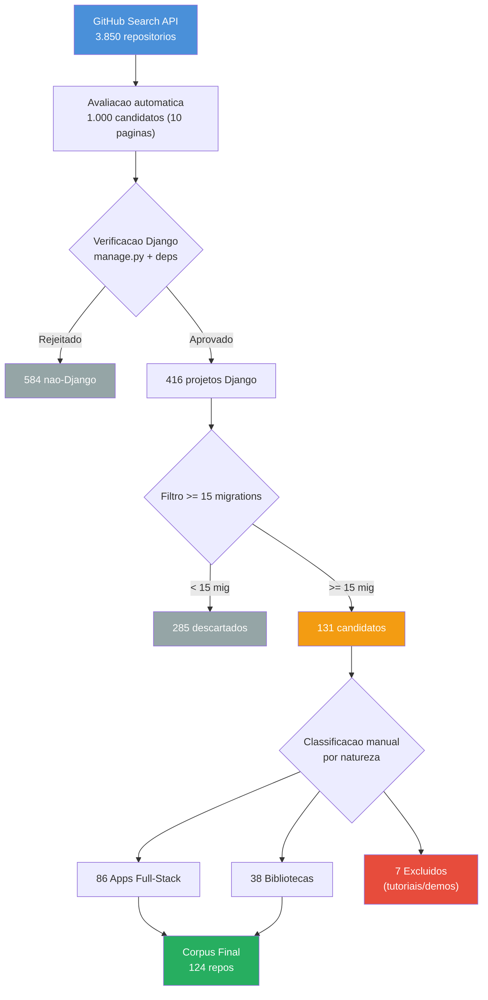
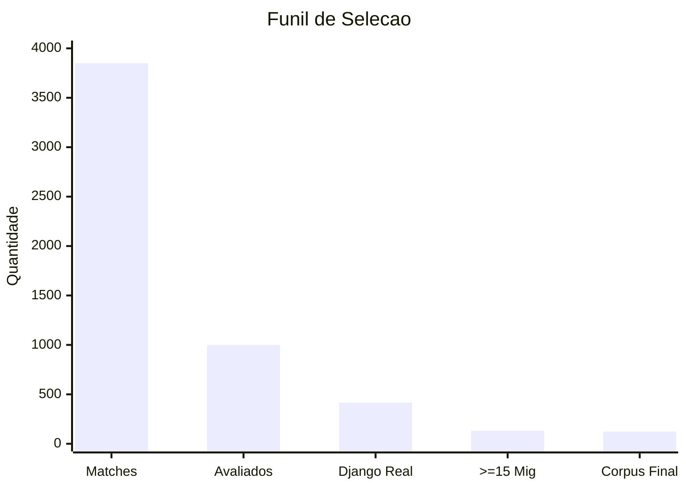
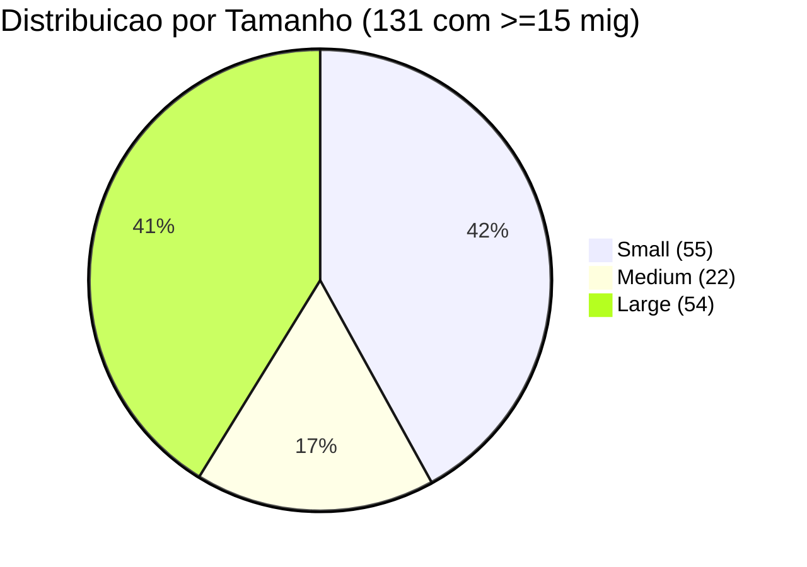
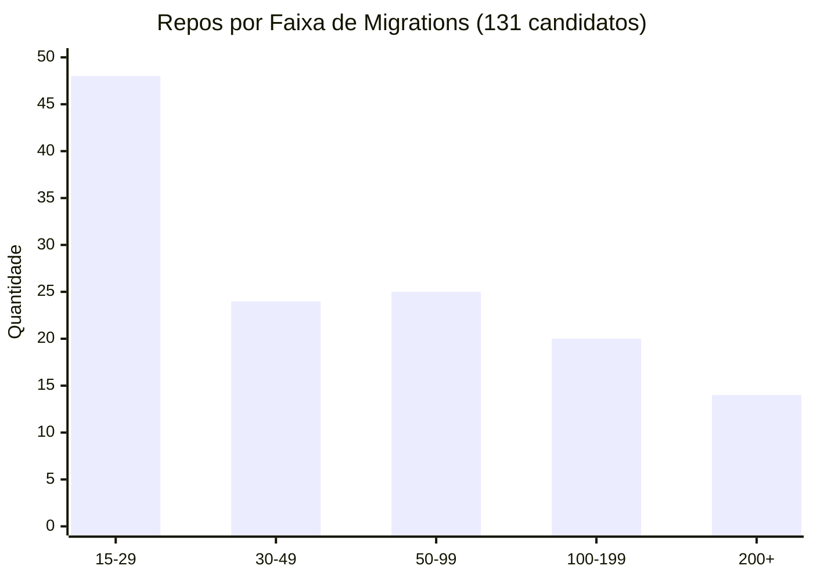
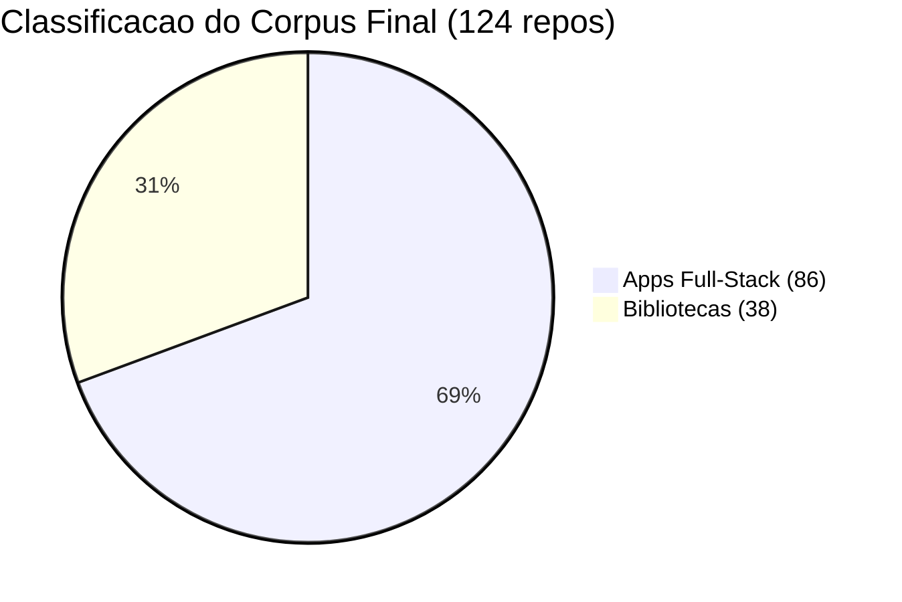
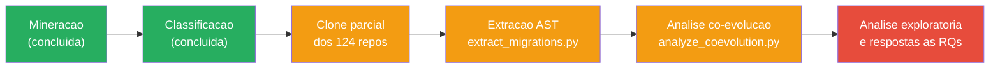

# Selecao do Corpus

Documentacao completa do processo de mineracao, filtragem, classificacao e selecao final dos repositorios que compoem o corpus do estudo.

---

## 1. Visao Geral do Processo

---

## 2. Evolucao da Mineracao: v1 vs v2

O processo de mineracao passou por duas iteracoes. A primeira revelou uma limitacao no script que motivou a criacao da segunda versao.

### 2.1 Primeira rodada (v1) — 2026-09-29

**Script:** `mine_repositories.py`
**Estrategia:** Bucket-filling — parava ao preencher quotas de Small/Medium/Large.

| Etapa | Quantidade |
|-------|-----------|
| Matches GitHub | 3.850 |
| Avaliados | ~300 (3 paginas) |
| Verificados como Django | 35 |
| Com >= 15 migrations | 17 |

**Problema identificado:** O script parava na pagina 3 ao preencher os buckets (~11 por tamanho). Repos com muitas migrations nas paginas 4-10 eram ignorados. A logica de bucket priorizava balanceamento de tamanho sobre volume de migrations.

### 2.2 Segunda rodada (v2) — 2026-09-30

**Script:** `mine_repositories_full.py`
**Estrategia:** Full-scan sem parada antecipada. Todas as 10 paginas. Migration count como criterio principal.

| Etapa | Quantidade |
|-------|-----------|
| Matches GitHub | 3.850 |
| Avaliados | 1.000 (10 paginas) |
| Verificados como Django | 416 |
| Com >= 15 migrations | 131 |

**Mudancas tecnicas:**
- Removida logica de bucket-filling
- Adicionado retry com exponential backoff para erros de conexao (ate 5 tentativas)
- Output ordenado por migration_count (decrescente)
- Todos os repos verificados salvos (nao apenas os acima do limiar)

### 2.3 Comparacao direta

```mermaid
xychart-beta
    title "Comparacao v1 vs v2"
    x-axis ["Avaliados", "Verificados", ">=15 Migrations"]
    y-axis "Quantidade" 0 --> 1100
    bar [300, 35, 17]
    bar [1000, 416, 131]
```

| Metrica | v1 | v2 | Ganho |
|---------|----|----|-------|
| Repos avaliados | 300 | 1.000 | 3.3x |
| Verificados como Django | 35 | 416 | 11.9x |
| Com >= 15 migrations | 17 | 131 | 7.7x |
| Paginas escaneadas | 3 | 10 | 3.3x |
| Tempo de execucao | ~5 min | ~25 min | — |

> **Conclusao:** A v1 capturou apenas 13% dos repos elegíveis. A limitacao de bucket-filling causava perda sistematica de dados. A v2 corrigiu isso com ganho de 7.7x no corpus.

---

## 3. Numeros do Funil (v2)

| Etapa | Quantidade | % do anterior | Metodo |
|-------|-----------|---------------|--------|
| Matches na busca GitHub | 3.850 | -- | GitHub Search API |
| Candidatos avaliados | 1.000 | 26,0% | 10 paginas x 100 |
| Verificados como Django real | 416 | 41,6% | manage.py + deps |
| Com >= 15 migrations | 131 | 31,5% | Contagem via tree API |
| Corpus final (excl. tutoriais) | 124 | 94,7% | Classificacao manual |

---

## 4. Distribuicoes

### 4.1 Por Tamanho do Projeto

### 4.2 Por Faixa de Migrations

| Faixa | Quantidade | % |
|-------|-----------|---|
| 15-29 | 48 | 36,6% |
| 30-49 | 24 | 18,3% |
| 50-99 | 25 | 19,1% |
| 100-199 | 20 | 15,3% |
| 200+ | 14 | 10,7% |

### 4.3 Por Natureza (Apps vs Libs)

| Grupo | Repos | Migrations total | Media por repo | Min | Max |
|-------|-------|-----------------|----------------|-----|-----|
| Apps | 86 | 10.724 | 125 | 15 | 666 |
| Libs | 38 | 1.131 | 30 | 15 | 131 |
| **Total** | **124** | **11.855** | **96** | **15** | **666** |

> Apps concentram 90% das migrations do corpus. Libs tem schema mais enxuto — consistente com a hipotese de que co-evolucao em libs e menor (RQ3).

---

## 5. Classificacao por Natureza

### 5.1 Criterios de Classificacao

A classificacao foi feita manualmente para cada um dos 131 repos, considerando:

1. **Nome e descricao do repositorio** no GitHub
2. **Proposito do projeto:** aplicacao completa vs componente reutilizavel
3. **Presenca de views, templates, admin:** apps tem ciclo completo; libs expoe models/API
4. **Padrao de uso:** libs sao instaladas via pip em outros projetos; apps rodam standalone

| Classificacao | Definicao | Exemplos |
|---------------|-----------|----------|
| **App** | Aplicacao Django completa, com ciclo de desenvolvimento real (features, bugfixes, deploy) | healthchecks, InvenTree, djangoproject.com |
| **Lib** | Pacote Django reutilizavel, instalado em outros projetos. Schema proprio mas codigo downstream vive fora do repo | django-allauth, django-celery-beat, django-guardian |
| **Excluido** | Projeto didatico, demo ou tutorial — migrations nao representam evolucao real de schema | dj4e-samples, bakerydemo, locallibrary-tutorial |

### 5.2 Apps Full-Stack (86 repos)

| Repo | Mig | Stars | Dominio |
|------|-----|-------|---------|
| mozilla/addons-server | 666 | 903 | Marketplace de extensoes |
| openedx/openedx-platform | 606 | 8.199 | LMS educacional |
| aropan/clist | 604 | 440 | Agregador de competicoes |
| MozillaFoundation/foundation.mozilla.org | 571 | 394 | Site institucional |
| MuckRock/muckrock | 548 | 125 | Plataforma FOIA |
| wevote/WeVoteServer | 425 | 56 | Plataforma de votacao |
| kobotoolbox/kpi | 383 | 185 | Coleta de dados humanitaria |
| SEED-platform/seed | 355 | 121 | Gestao energetica de edificios |
| bookwyrm-social/bookwyrm | 319 | 2.790 | Rede social de leitura |
| okfde/froide | 275 | 410 | Plataforma FOI |
| okfde/fragdenstaat_de | 241 | 148 | Plataforma FOI (Alemanha) |
| python/pythondotorg | 222 | 1.666 | Site python.org |
| freelawproject/courtlistener | 219 | 1.035 | Pesquisa juridica |
| Cloud-CV/EvalAI | 200 | 2.044 | Avaliacao de modelos AI |
| numerique-gouv/sites-conformes | 199 | 68 | Conformidade de sites gov |
| healthchecks/healthchecks | 187 | 10.371 | Monitoramento de cron jobs |
| inventree/InvenTree | 171 | 7.661 | ERP/inventario |
| apluslms/a-plus | 170 | 74 | Sistema de gestao de aprendizado |
| onaio/onadata | 163 | 188 | Coleta e analise de dados |
| vas3k/vas3k.club | 152 | 939 | Plataforma comunitaria |
| codalab/codabench | 151 | 178 | Benchmarking de ML |
| ietf-tools/datatracker | 149 | 1.094 | Rastreamento de documentos IETF |
| okfn/website | 145 | 109 | Site OKFN |
| digitalfox/pydici | 145 | 148 | CRM para consultorias |
| TareqMonwer/Django-School-Management | 144 | 593 | Gestao escolar |
| mozilla/kitsune | 144 | 1.657 | Suporte Mozilla (SUMO) |
| horilla/horilla-crm | 138 | 92 | Gestao de RH |
| modoboa/modoboa | 132 | 3.541 | Plataforma de email |
| python-discord/site | 121 | 650 | Site Python Discord |
| learningequality/studio | 120 | — | Autoria de conteudo Kolibri |
| open5e/open5e-api | 116 | — | API D&D 5e |
| mataroablog/mataroa | 114 | — | Plataforma de blog |
| bustimes/bustimes.org | 106 | — | Horarios de onibus UK |
| brightbeanxyz/brightbean-studio | 97 | — | Plataforma criativa |
| OSMCha/osmcha-django | 97 | — | Analisador OpenStreetMap |
| Nitrate/Nitrate | 79 | — | Gestao de casos de teste |
| KoalixSwitzerland/koalixcrm | 78 | — | CRM/ERP |
| kiwitcms/Kiwi | 67 | — | Gestao de testes |
| ialbert/biostar-central | 65 | — | Q&A bioinformatica |
| apache/airavata-django-portal | 64 | — | Portal cientifico |
| samuelclay/NewsBlur | 64 | — | Leitor RSS |
| django/djangoproject.com | 63 | 2.019 | Site oficial Django |
| mpkasp/django-bom | 63 | — | Gestao de BOM |
| kobotoolbox/kobocat | 60 | — | Backend KoBoToolbox |
| DataTalksClub/course-management-platform | 60 | — | Gestao de cursos |
| dfirtrack/dfirtrack | 58 | — | Forense digital |
| Ehco1996/django-sspanel | 56 | 3.073 | Painel proxy/VPN |
| CTPUG/wafer | 56 | — | Gestao de conferencias |
| line/promgen | 55 | — | Gestao Prometheus |
| hassancs91/PyRunner | 55 | — | Executor de codigo online |
| sissbruecker/linkding | 54 | 11.260 | Gerenciador de bookmarks |
| Checkora/Checkora | 53 | — | Plataforma de checklists |
| QingdaoU/OnlineJudge | 52 | — | Juiz online |
| kreneskyp/ix | 50 | — | Plataforma de agentes AI |
| getpatchwork/patchwork | 49 | — | Rastreamento de patches |
| DjangoGirls/djangogirls | 49 | — | Gestao de eventos DjangoGirls |
| djangopackages/djangopackages | 48 | 956 | Diretorio de pacotes Django |
| Hopetree/izone | 45 | — | Blog/site pessoal |
| meeb/tubesync | 45 | — | Sync YouTube-media |
| 1Panel-dev/MaxKB | 43 | — | Plataforma AI enterprise |
| nextcloud/appstore | 43 | — | App store Nextcloud |
| silverapp/silver | 42 | — | SaaS billing |
| django-helpdesk/django-helpdesk | 42 | 1.686 | Sistema de tickets |
| lihuacai168/AnotherFasterRunner | 41 | — | Testes de API |
| mwinamijr/django-scms | 38 | — | Gestao escolar |
| cfpb/consumerfinance.gov | 36 | — | Site CFPB (gov EUA) |
| DjangoCRM/django-crm | 35 | 631 | CRM |
| anyant/rssant | 35 | — | Leitor RSS |
| jimmy201602/webterminal | 34 | — | Terminal SSH web |
| innogames/ltc | 32 | — | Dashboard de load tests |
| thomas545/ecommerce_api | 31 | — | API e-commerce |
| phpmyadmin/website | 29 | — | Site phpMyAdmin |
| dtpstat/dtp-stat-archive | 25 | — | Mapa de acidentes |
| Kuldeeep18/LeadOrbit | 24 | — | Gestao de leads |
| liangliangyy/DjangoBlog | 20 | 7.435 | Blog |
| milesmcc/shynet | 20 | — | Analytics web |
| manjurulhoque/django-social-network | 18 | — | Rede social |
| redianmarku/Django-Twitter-Clone | 18 | — | Clone Twitter |
| delitamakanda/elearning | 18 | — | E-learning |
| chenjigang4167/testhub_platform | 18 | — | Plataforma de testes |
| visionsss/recommend_system_version2 | 18 | — | Sistema de recomendacao |
| grahamgilbert/Crypt-Server | 18 | — | Escrow FileVault |
| SkyCascade/SkyLearn | 16 | — | Plataforma educacional |
| AndyGrant/OpenBench | 16 | — | Testes de engines de xadrez |
| apyb/associados | 16 | — | Gestao de associados APyB |
| thiagopena/djangoSIGE | 15 | — | ERP |

### 5.3 Bibliotecas e Plugins (38 repos)

| Repo | Mig | Stars | Funcionalidade |
|------|-----|-------|----------------|
| tbicr/django-pg-zero-downtime-migrations | 131 | 574 | Migrations zero-downtime |
| ansible/django-ansible-base | 83 | — | Base compartilhada Ansible |
| ellmetha/django-machina | 52 | — | Engine de forum |
| adamcharnock/django-hordak | 54 | — | Contabilidade double-entry |
| 3YOURMIND/django-migration-linter | 45 | — | Linter de migrations |
| PragmaticMates/django-invoicing | 35 | — | Faturamento |
| citusdata/django-multitenant | 33 | — | Suporte multi-tenant |
| fabiocaccamo/django-admin-interface | 32 | — | Tema de admin |
| tj-django/django-clone | 32 | — | Clonagem de models |
| arrobalytics/django-ledger | 30 | 1.389 | Contabilidade |
| django-getpaid/django-getpaid | 29 | — | Framework de pagamentos |
| palewire/django-calaccess-raw-data | 29 | — | Dados eleitorais California |
| explorerhq/sql-explorer | 28 | — | Explorador SQL |
| django-cms/django-cms | 26 | 10.673 | Framework CMS |
| django-guardian/django-guardian | 26 | 3.917 | Permissoes por objeto |
| django-cms/django-filer | 25 | 1.853 | Gestao de arquivos |
| microsoft/mssql-django | 25 | — | Backend MSSQL |
| AmbitionEng/django-pghistory | 25 | — | Historico Postgres |
| pennersr/django-allauth | 24 | 10.376 | Autenticacao/OAuth |
| SectorLabs/django-postgres-extra | 24 | — | Extensoes Postgres |
| stellar/django-polaris | 24 | — | Anchor server Stellar |
| celery/django-celery-beat | 23 | 1.951 | Scheduler Celery |
| soynatan/django-easy-audit | 23 | — | Auditoria |
| bennylope/django-organizations | 22 | — | Multi-organizacao |
| djaodjin/djaodjin-saas | 22 | — | Gestao SaaS |
| RealOrangeOne/django-tasks-db | 21 | — | Backend de tarefas |
| viewflow/viewflow | 20 | — | Workflow/BPM |
| Yuego/django-fias | 20 | — | Enderecos russos |
| spookylukey/django-paypal | 19 | — | Integracao PayPal |
| socotecio/django-socio-grpc | 18 | — | Integracao gRPC |
| PaulGilmartin/django-pgpubsub | 18 | — | Pub/sub Postgres |
| python-social-auth/social-app-django | 17 | 2.145 | Auth social |
| simplecto/django-reference-implementation | 17 | — | Implementacao referencia |
| reactive-python/reactpy-django | 16 | — | Integracao ReactPy |
| django-otp/django-otp | 16 | — | OTP/2FA |
| matijakolaric-com/django-music-publisher | 16 | — | Publicacao musical |
| yunojuno/elasticsearch-django | 16 | — | Integracao Elasticsearch |
| AmbitionEng/django-pgtrigger | 15 | — | Triggers Postgres |

### 5.4 Excluidos (7 repos)

| Repo | Mig | Motivo |
|------|-----|--------|
| wagtail/bakerydemo | 60 | Demo do Wagtail CMS |
| wsvincent/rest-framework-tutorial | 45 | Tutorial DRF |
| mdn/django-locallibrary-tutorial | 27 | Tutorial MDN |
| csev/dj4e-samples | 23 | Exemplos do curso Django for Everybody |
| saksham1991999/django-for-everybody-specialization | 18 | Exercicios de curso |
| HackSoftware/Django-Styleguide-Example | 15 | Exemplo de styleguide |
| codingforentrepreneurs/SaaS-for-Enterprise-with-Django | 28 | Tutorial |

> Projetos didaticos foram excluidos porque suas migrations nao representam evolucao organica de schema — sao exemplos criados para fins de ensino.

---

## 6. Decisoes Resolvidas

| Decisao | Resolucao |
|---------|-----------|
| Quantos repos no corpus? | 124 (todos com >=15 mig, exceto tutoriais) |
| Classificar apps vs libs? | Sim — 86 apps, 38 libs. Classificacao manual salva em `data/processed/corpus_classification.json` |
| Excluir projetos didaticos? | Sim — 7 excluidos (tutorials, demos, course exercises) |
| Separar apps vs libs na analise? | Sim — necessario para RQ3 |
| Expandir mineracao alem de 3 paginas? | Sim — v2 cobriu 10 paginas, ganho de 7.7x |

### Decisoes ainda pendentes

| Decisao | Opcoes | Status |
|---------|--------|--------|
| Tratar outliers extremos na analise? | (a) Incluir todos, (b) Cap em N migrations, (c) Analise com e sem outliers | Avaliar apos dados |

---

## 7. Proximos Passos

---

## Apendice: Dados Brutos

| Arquivo | Descricao |
|---------|-----------|
| [`data/raw/candidates_full.csv`](../data/raw/candidates_full.csv) | 416 repos verificados (full-scan v2) |
| [`data/raw/candidates_full.json`](../data/raw/candidates_full.json) | Mesmos dados em JSON |
| [`data/raw/candidates.csv`](../data/raw/candidates.csv) | 35 repos (amostra v1, preservada para comparacao) |
| [`data/processed/corpus_classification.json`](../data/processed/corpus_classification.json) | Classificacao manual dos 131 repos (app/lib/exclude) |
| [`scripts/mine_repositories.py`](../scripts/mine_repositories.py) | Script v1 (bucket-filling) |
| [`scripts/mine_repositories_full.py`](../scripts/mine_repositories_full.py) | Script v2 (full-scan com retry) |
