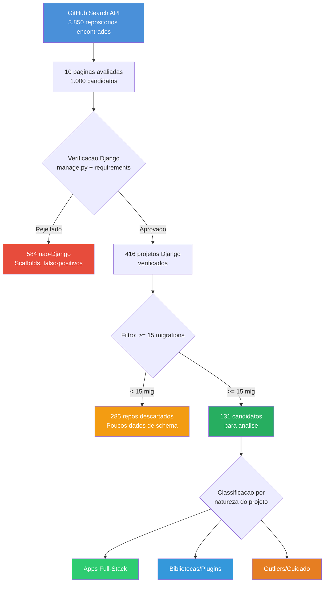
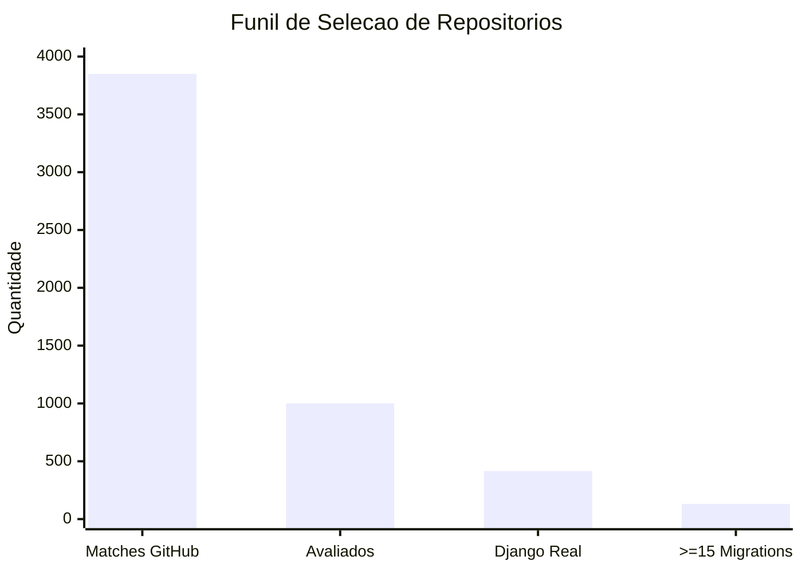
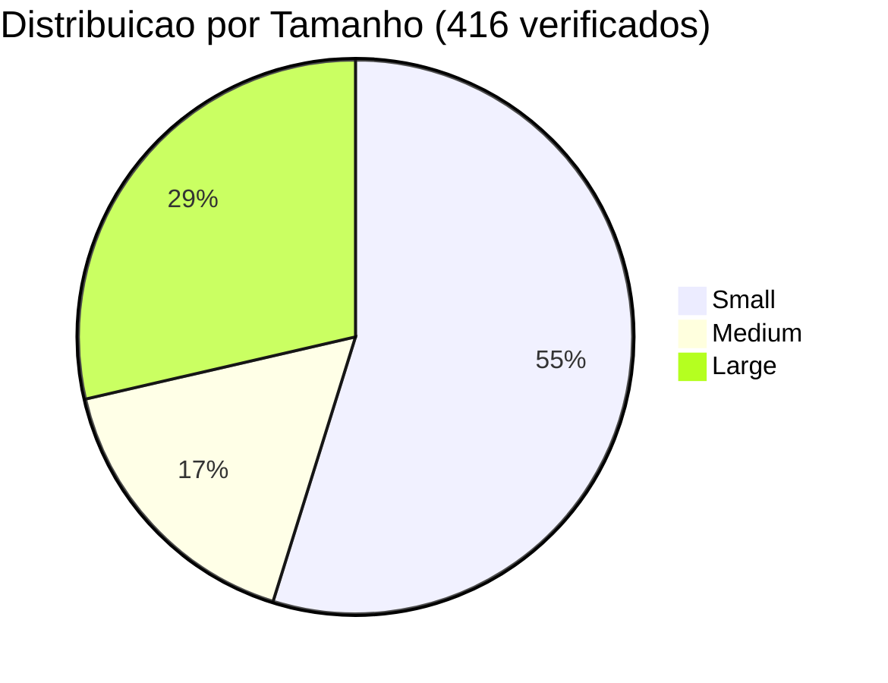
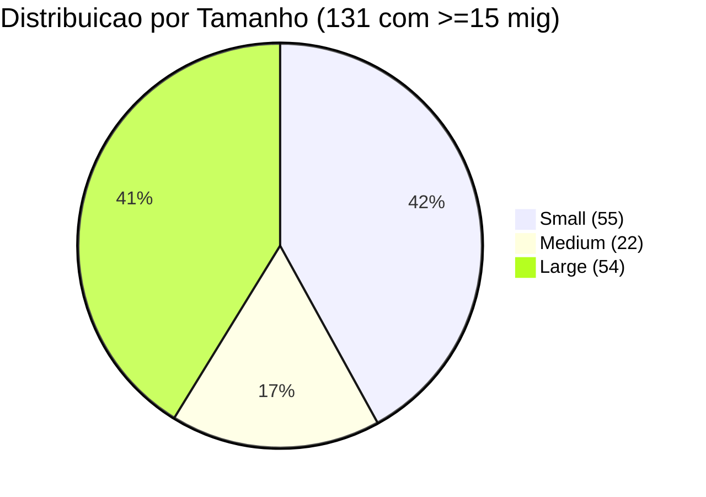
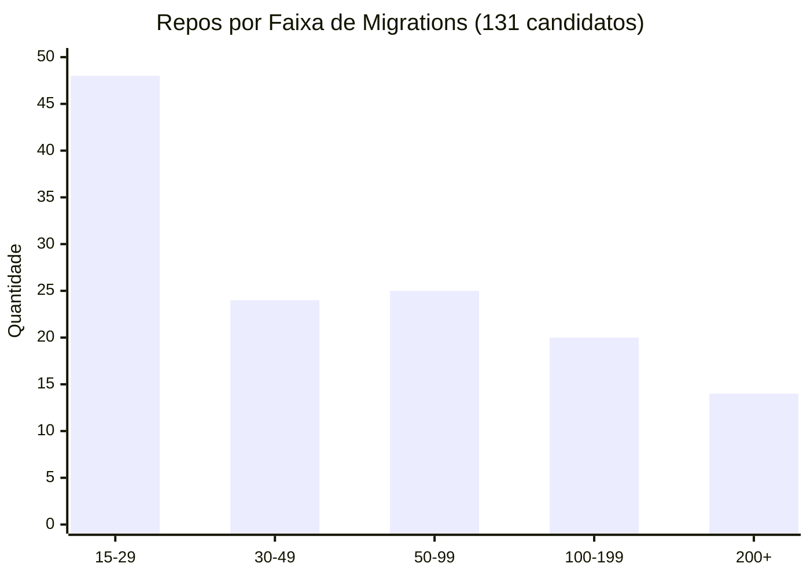
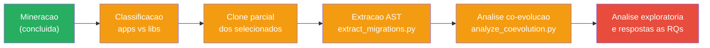

# Selecao do Corpus

Documentacao completa do processo de mineracao, filtragem e selecao dos repositorios que compoem o corpus do estudo.

**Data da mineracao:** 2026-09-30
**Script utilizado:** `scripts/mine_repositories_full.py` (full-scan, 10 paginas)

---

## 1. Visao Geral do Processo



---

## 2. Parametros da Busca

### Query GitHub Search API

```
django in:name,description,readme,topics language:Python fork:false pushed:>=2024-09-30 stars:>=20
```

### Criterios aplicados em sequencia

| # | Criterio | Tipo | Responsavel |
|---|----------|------|-------------|
| 1 | Termo "django" no nome, descricao, readme ou topics | Busca | GitHub API |
| 2 | Linguagem principal: Python | Busca | GitHub API |
| 3 | Nao e fork | Busca | GitHub API |
| 4 | Push nos ultimos 2 anos | Busca | GitHub API |
| 5 | >= 20 stars | Busca | GitHub API |
| 6 | Projeto Django real (manage.py + Django em deps) | Verificacao | `mine_repositories_full.py` |
| 7 | >= 15 arquivos de migration | Filtragem | Pos-coleta |

### Numeros do funil



| Etapa | Quantidade | % do anterior |
|-------|-----------|---------------|
| Matches na busca GitHub | 3.850 | -- |
| Candidatos avaliados (10 paginas) | 1.000 | 26,0% |
| Verificados como projeto Django real | 416 | 41,6% |
| Com >= 15 migrations | 131 | 31,5% |

### Comparacao v1 vs v2

| Metrica | v1 (buckets, 3 pag) | v2 (full-scan, 10 pag) |
|---------|---------------------|------------------------|
| Repos avaliados | 300 | 1.000 |
| Verificados | 35 | 416 |
| Com >= 15 mig | 17 | 131 |

> A v1 parava prematuramente ao preencher buckets (Small/Medium/Large). A v2 varre todas as 10 paginas sem parada antecipada, usando migration count como criterio principal.

---

## 3. Distribuicao por Tamanho





---

## 4. Distribuicao por Faixa de Migrations



| Faixa | Quantidade | % |
|-------|-----------|---|
| 15-29 | 48 | 36,6% |
| 30-49 | 24 | 18,3% |
| 50-99 | 25 | 19,1% |
| 100-199 | 20 | 15,3% |
| 200+ | 14 | 10,7% |

**Observacao:** Distribuicao equilibrada. 59 repos (45%) com 50+ migrations — material substancial para analise de co-evolucao.

---

## 5. Top 30 Candidatos por Volume de Migrations

| # | Repo | Stars | Mig | Apps | Size |
|---|------|-------|-----|------|------|
| 1 | mozilla/addons-server | 903 | 666 | 31 | Large |
| 2 | openedx/openedx-platform | 8.199 | 606 | 83 | Large |
| 3 | aropan/clist | 440 | 604 | 13 | Large |
| 4 | MozillaFoundation/foundation.mozilla.org | 394 | 571 | 22 | Small |
| 5 | MuckRock/muckrock | 125 | 548 | 21 | Large |
| 6 | wevote/WeVoteServer | 56 | 425 | 57 | Large |
| 7 | kobotoolbox/kpi | 185 | 383 | 30 | Large |
| 8 | SEED-platform/seed | 121 | 355 | 5 | Small |
| 9 | bookwyrm-social/bookwyrm | 2.790 | 319 | 1 | Small |
| 10 | okfde/froide | 410 | 275 | 20 | Large |
| 11 | okfde/fragdenstaat_de | 148 | 241 | 6 | Large |
| 12 | python/pythondotorg | 1.666 | 222 | 16 | Large |
| 13 | freelawproject/courtlistener | 1.035 | 219 | 19 | Large |
| 14 | Cloud-CV/EvalAI | 2.044 | 200 | 7 | Large |
| 15 | healthchecks/healthchecks | 10.371 | 187 | 4 | Large |
| 16 | inventree/InvenTree | 7.661 | 171 | 13 | Large |
| 17 | apluslms/a-plus | 74 | 170 | 12 | Large |
| 18 | onaio/onadata | 188 | 163 | 5 | Small |
| 19 | vas3k/vas3k.club | 939 | 152 | 20 | Large |
| 20 | codalab/codabench | 178 | 151 | 11 | Large |
| 21 | ietf-tools/datatracker | 1.094 | 149 | 22 | Large |
| 22 | digitalfox/pydici | 148 | 145 | 7 | Large |
| 23 | TareqMonwer/Django-School-Management | 593 | 144 | 10 | Large |
| 24 | mozilla/kitsune | 1.657 | 144 | 27 | Large |
| 25 | horilla/horilla-crm | 92 | 138 | 30 | Large |
| 26 | modoboa/modoboa | 3.541 | 132 | 15 | Large |
| 27 | tbicr/django-pg-zero-downtime-migrations | 574 | 131 | 32 | Small |
| 28 | python-discord/site | 650 | 121 | 4 | Medium |
| 29 | pretalx/pretalx | 2.103 | 118 | 6 | Large |
| 30 | django/djangoproject.com | 2.019 | 63 | 11 | Large |

---

## 6. Decisoes Pendentes

| Decisao | Opcoes | Status |
|---------|--------|--------|
| Definir corpus final | Selecionar subconjunto dos 131 ou usar todos | Pendente |
| Criterio de corte | Por faixa de migrations, por natureza (app/lib), ou ambos | Pendente |
| Classificar apps vs libs | Necessario para RQ3 — classificacao manual dos 131 | Pendente |
| Excluir outliers extremos? | mozilla/addons-server (666 mig), openedx (606 mig) — podem dominar metricas | Pendente |
| Excluir projetos didaticos? | Ex: dj4e-samples, crash-course-CRM | Pendente |

---

## 7. Proximos Passos



---

## Apendice: Dados Brutos

- **Full-scan (v2):** [`data/raw/candidates_full.csv`](../data/raw/candidates_full.csv) / [`candidates_full.json`](../data/raw/candidates_full.json) — 416 repos, 131 com >=15 mig
- **Amostra inicial (v1):** [`data/raw/candidates.csv`](../data/raw/candidates.csv) / [`candidates.json`](../data/raw/candidates.json) — 35 repos, 17 com >=15 mig
- **Scripts:** [`mine_repositories.py`](../scripts/mine_repositories.py) (v1) / [`mine_repositories_full.py`](../scripts/mine_repositories_full.py) (v2)
